---
jupyter:
  kernelspec:
    display_name: Python 3
    language: python
    name: python3
  language_info:
    codemirror_mode:
      name: ipython
      version: 3
    file_extension: .py
    mimetype: text/x-python
    name: python
    nbconvert_exporter: python
    pygments_lexer: ipython3
    version: 3.7.12
  nbformat: 4
  nbformat_minor: 4
---

::: {.cell .markdown}
# Olympic Capstone Project
:::

::: {.cell .markdown}

:::

::: {.cell .markdown}
# Introduction
:::

::: {.cell .markdown}
The Olympics are regarded as a major athletic event in which thousands
of competitors from all over the world compete in a range of events.
Nations from all over the world compete, and the Olympic games are often
regarded as the world\'s most popular sporting event. Data Science and
Machine Learning techniques will be of significant assistance in the
decision-making processes of trainers, players, and governments in these
countries.

The findings may be used to highlight the need for new policies to
increase the quality of physical education in a country. According to
the data, a variety of factors contribute to these countries\'
performance in the games.

The following dataset contains information about olympic events that
occurred between 2000 and 2012. Summer and winter olympic sports are
also included. The dataset has a total of ten features. There are 8618
observations.

    Players' names, ages, countries, medal types, and total medals earned are all included in the data collection.
    The dataset also assume Madel won in group sports also as individual Medal for each player.

    A single player can play many games.

    Year - The year in which a certain olympic event took place.

    Date Given - The date on which a sporting event will take place.

    Same A player can compete in a number of Olympic events.
:::

::: {.cell .markdown}
## Step 2 (Python and DS): Read the dataset in pandas and perform the steps as suggested. {#step-2-python-and-ds-read-the-dataset-in-pandas-and-perform-the-steps-as-suggested}
:::

::: {.cell .markdown}
1.  Please do the basic exploration of the data. (Remember the dataset
    contains information from different years. So whatever steps you
    perform should make logical sense.)
2.  Deal with missing values appropriately. You can either remove them
    or fill them, but a proper justification is required.
3.  Duplicates in the dataset introduces bias in the study. Please check
    and perform appropriate steps.
4.  Please remove special characters from the name column.
5.  Perform data visualization techniques to appropriate columns and
    explain them.\
6.  Please check if the age dataset is skewed or symmetric. Based on
    results perform transformation.
7.  Please perform appropriate numerical measures on each column and
    report them accordingly.
8.  Please list the top 10 countries with the gold medal, then top10
    countries with the silver medal, then bronze medal and the total
    medal.
:::

::: {.cell .markdown}
## Step 3 (PySpark): Once u have done the data cleaning please convert the pandas dataframe to pyspark dataframe and do the following transformation
:::

::: {.cell .markdown}
1.  Write PySpark code to read olympix_data.csv file
2.  Write PySpark code to print the Olympic Sports/games in the dataset.
3.  Write PySpark code to plot the total number of medals in each
    Olympic Sport/game
4.  Sort the result based on the total number of medals.
5.  Find the total number of medals won by each country in swimming.
6.  Find the total number of medals won by each country in Skeleton.
7.  Find the number of medals that the US won yearly.
8.  Find the total number of medals won by each country.
9.  Who was the oldest athlete in the olympics?
10. Which country was he/she from?
:::

::: {.cell .markdown}
### Import Dependecies
:::

::: {.cell .code execution_count="1" execution="{\"iopub.status.busy\":\"2022-05-31T17:17:03.998184Z\",\"shell.execute_reply.started\":\"2022-05-31T17:17:03.998477Z\",\"iopub.status.idle\":\"2022-05-31T17:17:04.500035Z\",\"iopub.execute_input\":\"2022-05-31T17:17:03.998572Z\",\"shell.execute_reply\":\"2022-05-31T17:17:04.499046Z\"}" trusted="true"}
``` {.python}
import numpy as np # linear algebra
import pandas as pd # data processing, CSV file I/O (e.g. pd.read_csv)
import matplotlib.pyplot as plt #plotiing
import seaborn as sns #plotiing
import missingno as msno # missing value
%matplotlib inline
plt.style.use('dark_background')
```
:::

::: {.cell .markdown}
## Loading data from a CSV file(s):
:::

::: {.cell .code execution_count="2" execution="{\"iopub.status.busy\":\"2022-05-31T17:17:04.501623Z\",\"shell.execute_reply.started\":\"2022-05-31T17:17:04.501891Z\",\"iopub.status.idle\":\"2022-05-31T17:17:04.529945Z\",\"iopub.execute_input\":\"2022-05-31T17:17:04.501936Z\",\"shell.execute_reply\":\"2022-05-31T17:17:04.529018Z\"}" trusted="true"}
``` {.python}
file_location ='/kaggle/input/olympic/olympic.csv'# filepath
olympic=pd.read_csv(file_location)# reading data
```
:::

::: {.cell .markdown}
## Dimension of data
:::

::: {.cell .code execution_count="3" execution="{\"iopub.status.busy\":\"2022-05-31T17:17:04.531208Z\",\"shell.execute_reply.started\":\"2022-05-31T17:17:04.531518Z\",\"iopub.status.idle\":\"2022-05-31T17:17:04.538736Z\",\"iopub.execute_input\":\"2022-05-31T17:17:04.531550Z\",\"shell.execute_reply\":\"2022-05-31T17:17:04.537891Z\"}" trusted="true"}
``` {.python}
olympic.shape# shape of data
```

::: {.output .execute_result execution_count="3"}
    (8618, 10)
:::
:::

::: {.cell .markdown}
## Overview of the data
:::

::: {.cell .code execution_count="4" execution="{\"iopub.status.busy\":\"2022-05-31T17:17:04.539940Z\",\"shell.execute_reply.started\":\"2022-05-31T17:17:04.540137Z\",\"iopub.status.idle\":\"2022-05-31T17:17:04.560650Z\",\"iopub.execute_input\":\"2022-05-31T17:17:04.540164Z\",\"shell.execute_reply\":\"2022-05-31T17:17:04.559417Z\"}" trusted="true"}
``` {.python}
olympic.head(3)#Print first three observations
```

::: {.output .execute_result execution_count="4"}
```{=html}
<div>
<style scoped>
    .dataframe tbody tr th:only-of-type {
        vertical-align: middle;
    }

    .dataframe tbody tr th {
        vertical-align: top;
    }

    .dataframe thead th {
        text-align: right;
    }
</style>
<table border="1" class="dataframe">
  <thead>
    <tr style="text-align: right;">
      <th></th>
      <th>name</th>
      <th>age</th>
      <th>country</th>
      <th>year</th>
      <th>Date_Given</th>
      <th>sports</th>
      <th>gold_medal</th>
      <th>silver_medal</th>
      <th>brone_medal</th>
      <th>total_medal</th>
    </tr>
  </thead>
  <tbody>
    <tr>
      <th>0</th>
      <td>Michael Phelps</td>
      <td>23.0</td>
      <td>United States</td>
      <td>2008</td>
      <td>8/24/2008</td>
      <td>Swimming</td>
      <td>8</td>
      <td>0</td>
      <td>0</td>
      <td>8</td>
    </tr>
    <tr>
      <th>1</th>
      <td>Michael Phelps</td>
      <td>19.0</td>
      <td>United States</td>
      <td>2004</td>
      <td>8/29/2004</td>
      <td>Swimming</td>
      <td>6</td>
      <td>0</td>
      <td>2</td>
      <td>8</td>
    </tr>
    <tr>
      <th>2</th>
      <td>Michael Phelps</td>
      <td>27.0</td>
      <td>United States</td>
      <td>2012</td>
      <td>08-12-2012</td>
      <td>Swimming</td>
      <td>4</td>
      <td>2</td>
      <td>0</td>
      <td>6</td>
    </tr>
  </tbody>
</table>
</div>
```
:::
:::

::: {.cell .code execution_count="5" execution="{\"iopub.status.busy\":\"2022-05-31T17:17:04.563383Z\",\"shell.execute_reply.started\":\"2022-05-31T17:17:04.563668Z\",\"iopub.status.idle\":\"2022-05-31T17:17:04.577154Z\",\"iopub.execute_input\":\"2022-05-31T17:17:04.563712Z\",\"shell.execute_reply\":\"2022-05-31T17:17:04.576083Z\"}" trusted="true"}
``` {.python}
olympic.tail(3)#Print last three observations
```

::: {.output .execute_result execution_count="5"}
```{=html}
<div>
<style scoped>
    .dataframe tbody tr th:only-of-type {
        vertical-align: middle;
    }

    .dataframe tbody tr th {
        vertical-align: top;
    }

    .dataframe thead th {
        text-align: right;
    }
</style>
<table border="1" class="dataframe">
  <thead>
    <tr style="text-align: right;">
      <th></th>
      <th>name</th>
      <th>age</th>
      <th>country</th>
      <th>year</th>
      <th>Date_Given</th>
      <th>sports</th>
      <th>gold_medal</th>
      <th>silver_medal</th>
      <th>brone_medal</th>
      <th>total_medal</th>
    </tr>
  </thead>
  <tbody>
    <tr>
      <th>8615</th>
      <td>Wietse van Alten</td>
      <td>21.0</td>
      <td>Netherlands</td>
      <td>2000</td>
      <td>10-01-2000</td>
      <td>Archery</td>
      <td>0</td>
      <td>0</td>
      <td>1</td>
      <td>1</td>
    </tr>
    <tr>
      <th>8616</th>
      <td>Sandra Wagner-Sachse</td>
      <td>31.0</td>
      <td>Germany</td>
      <td>2000</td>
      <td>10-01-2000</td>
      <td>Archery</td>
      <td>0</td>
      <td>0</td>
      <td>1</td>
      <td>1</td>
    </tr>
    <tr>
      <th>8617</th>
      <td>Rod White</td>
      <td>23.0</td>
      <td>United States</td>
      <td>2000</td>
      <td>10-01-2000</td>
      <td>Archery</td>
      <td>0</td>
      <td>0</td>
      <td>1</td>
      <td>1</td>
    </tr>
  </tbody>
</table>
</div>
```
:::
:::

::: {.cell .markdown}
## Identify variables
:::

::: {.cell .code execution_count="6" execution="{\"iopub.status.busy\":\"2022-05-31T17:17:04.578830Z\",\"shell.execute_reply.started\":\"2022-05-31T17:17:04.579118Z\",\"iopub.status.idle\":\"2022-05-31T17:17:04.597417Z\",\"iopub.execute_input\":\"2022-05-31T17:17:04.579242Z\",\"shell.execute_reply\":\"2022-05-31T17:17:04.596598Z\"}" trusted="true"}
``` {.python}
olympic.dtypes# data types
```

::: {.output .execute_result execution_count="6"}
    name             object
    age             float64
    country          object
    year              int64
    Date_Given       object
    sports           object
    gold_medal        int64
    silver_medal      int64
    brone_medal       int64
    total_medal       int64
    dtype: object
:::
:::

::: {.cell .code execution_count="7" execution="{\"iopub.status.busy\":\"2022-05-31T17:17:04.598402Z\",\"shell.execute_reply.started\":\"2022-05-31T17:17:04.599081Z\",\"iopub.status.idle\":\"2022-05-31T17:17:04.623628Z\",\"iopub.execute_input\":\"2022-05-31T17:17:04.599118Z\",\"shell.execute_reply\":\"2022-05-31T17:17:04.622924Z\"}" trusted="true"}
``` {.python}
olympic['Date_Given']=olympic['Date_Given'].str.replace('/','-')#inconsistent date so bring in single format
olympic['Date_Given'] = olympic['Date_Given'].astype('datetime64[ns]')# changing to appriopate data types
olympic['year'] = olympic['year'].astype('category')# changing to appriopate data types
olympic['country'] = olympic['country'].astype('category')# changing to appriopate data types
olympic['sports'] = olympic['sports'].astype('category')# changing to appriopate data types
```
:::

::: {.cell .markdown}
## Observation

                 Earlier    Later
  -------------- ---------- ------------------
  name           object     object
  age            float64    float64
  country        category   category
  year           int64      category
  Date_Given     object     datetime64\[ns\]
  sports         object     category
  gold_medal     int64      int64
  silver_medal   int64      int64
  brone_medal    int64      int64
  total_medal    int64      int64
:::

::: {.cell .markdown}
# 1. Please do the basic exploration of the data. {#1-please-do-the-basic-exploration-of-the-data}
:::

::: {.cell .markdown}
## Missing Value in Dataset
:::

::: {.cell .code execution_count="8" execution="{\"iopub.status.busy\":\"2022-05-31T17:17:04.624688Z\",\"shell.execute_reply.started\":\"2022-05-31T17:17:04.625389Z\",\"iopub.status.idle\":\"2022-05-31T17:17:04.635010Z\",\"iopub.execute_input\":\"2022-05-31T17:17:04.625437Z\",\"shell.execute_reply\":\"2022-05-31T17:17:04.634385Z\"}" trusted="true"}
``` {.python}
print("Number of missing value in dataset")
olympic.isnull().sum()#sum of missing value
```

::: {.output .stream .stdout}
    Number of missing value in dataset
:::

::: {.output .execute_result execution_count="8"}
    name            5
    age             5
    country         0
    year            0
    Date_Given      0
    sports          0
    gold_medal      0
    silver_medal    0
    brone_medal     0
    total_medal     0
    dtype: int64
:::
:::

::: {.cell .code execution_count="9" execution="{\"iopub.status.busy\":\"2022-05-31T17:17:04.636419Z\",\"shell.execute_reply.started\":\"2022-05-31T17:17:04.636832Z\",\"iopub.status.idle\":\"2022-05-31T17:17:05.372590Z\",\"iopub.execute_input\":\"2022-05-31T17:17:04.636874Z\",\"shell.execute_reply\":\"2022-05-31T17:17:05.371650Z\"}" trusted="true"}
``` {.python}
msno.bar(olympic)# plotting missing values
```

::: {.output .execute_result execution_count="9"}
    <AxesSubplot:>
:::

::: {.output .display_data}
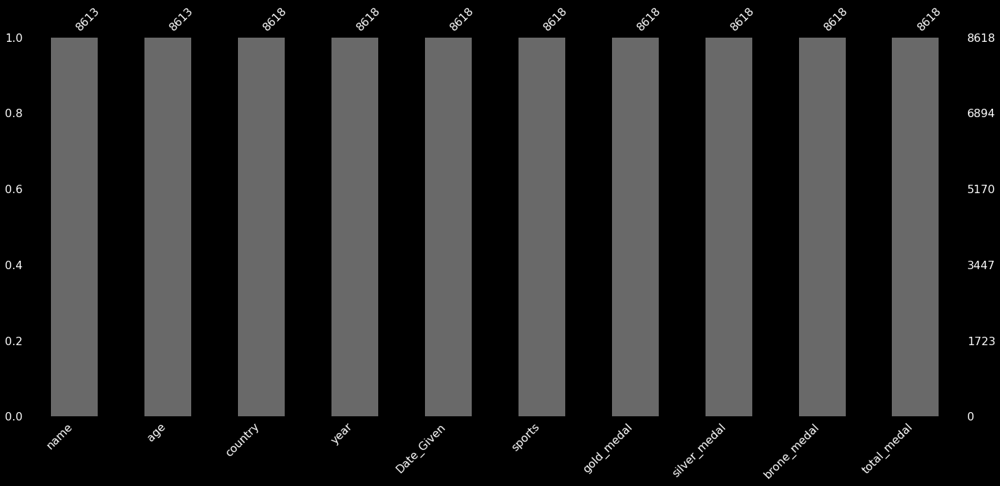
:::
:::

::: {.cell .markdown}
5 null values in name and age column
:::

::: {.cell .markdown}
## Duplicate Value in DataSet
:::

::: {.cell .code execution_count="10" execution="{\"iopub.status.busy\":\"2022-05-31T17:17:05.373686Z\",\"shell.execute_reply.started\":\"2022-05-31T17:17:05.373885Z\",\"iopub.status.idle\":\"2022-05-31T17:17:05.388592Z\",\"iopub.execute_input\":\"2022-05-31T17:17:05.373915Z\",\"shell.execute_reply\":\"2022-05-31T17:17:05.387866Z\"}" trusted="true"}
``` {.python}
print("Number of duplicated value in dataset")
olympic.duplicated().sum()#sum of duplicated value
```

::: {.output .stream .stdout}
    Number of duplicated value in dataset
:::

::: {.output .execute_result execution_count="10"}
    3
:::
:::

::: {.cell .markdown}
3 duplicate values
:::

::: {.cell .markdown}
### Dividing DataSet Based on Winter and Summer (for exploration purpose)
:::

::: {.cell .code execution_count="11" execution="{\"iopub.status.busy\":\"2022-05-31T17:17:05.389483Z\",\"shell.execute_reply.started\":\"2022-05-31T17:17:05.390342Z\",\"iopub.status.idle\":\"2022-05-31T17:17:05.395672Z\",\"iopub.execute_input\":\"2022-05-31T17:17:05.390378Z\",\"shell.execute_reply\":\"2022-05-31T17:17:05.395117Z\"}" trusted="true"}
``` {.python}
df1=olympic.copy(deep=True)# making duplicated copy
```
:::

::: {.cell .code execution_count="12" execution="{\"iopub.status.busy\":\"2022-05-31T17:17:05.396529Z\",\"shell.execute_reply.started\":\"2022-05-31T17:17:05.396998Z\",\"iopub.status.idle\":\"2022-05-31T17:17:05.411791Z\",\"iopub.execute_input\":\"2022-05-31T17:17:05.397029Z\",\"shell.execute_reply\":\"2022-05-31T17:17:05.411007Z\"}" trusted="true"}
``` {.python}
df1['month'] = df1['Date_Given'].dt.month# extracting month because winter olympic occur on februry 
df1['season'] = np.where(df1['month']== 2, 'winter', 'summer')# new column based on condition
```
:::

::: {.cell .code execution_count="13" execution="{\"iopub.status.busy\":\"2022-05-31T17:17:05.412667Z\",\"shell.execute_reply.started\":\"2022-05-31T17:17:05.413246Z\",\"iopub.status.idle\":\"2022-05-31T17:17:05.422859Z\",\"iopub.execute_input\":\"2022-05-31T17:17:05.413281Z\",\"shell.execute_reply\":\"2022-05-31T17:17:05.422160Z\"}" trusted="true"}
``` {.python}
summer=df1[df1['season']=='summer']# filter dataset
winter=df1[df1['season']=='winter']# filter dataset
```
:::

::: {.cell .code execution_count="14" execution="{\"iopub.status.busy\":\"2022-05-31T17:17:05.425927Z\",\"shell.execute_reply.started\":\"2022-05-31T17:17:05.426147Z\",\"iopub.status.idle\":\"2022-05-31T17:17:05.431904Z\",\"iopub.execute_input\":\"2022-05-31T17:17:05.426175Z\",\"shell.execute_reply\":\"2022-05-31T17:17:05.431271Z\"}" trusted="true"}
``` {.python}
def summer_olympic(year):# filter dataset baed on year
    return summer[summer['year']==year]
```
:::

::: {.cell .markdown}
### Distribution of player in each olympic
:::

::: {.cell .code trusted="true"}
``` {.python}
```
:::

::: {.cell .markdown}
# 2. Deal with missing values appropriately. You can either remove them or fill them, but a proper justification is required. {#2-deal-with-missing-values-appropriately-you-can-either-remove-them-or-fill-them-but-a-proper-justification-is-required}
:::

::: {.cell .code execution_count="15" execution="{\"iopub.status.busy\":\"2022-05-31T17:17:05.433110Z\",\"shell.execute_reply.started\":\"2022-05-31T17:17:05.433781Z\",\"iopub.status.idle\":\"2022-05-31T17:17:05.456529Z\",\"iopub.execute_input\":\"2022-05-31T17:17:05.433817Z\",\"shell.execute_reply\":\"2022-05-31T17:17:05.455856Z\"}" trusted="true"}
``` {.python}
summer_2000=summer_olympic(2000)
summer_2004=summer_olympic(2004)
summer_2008=summer_olympic(2008)
summer_2012=summer_olympic(2012)
print('olympic:' ,'Skewness_of_Age', 'Dimensions','Missing Values')
print('summer      :',summer['age'].skew().round(1),summer.shape,summer['age'].isnull().sum())
print('summer 2000 :',summer_2000['age'].skew().round(1),summer_2000.shape,summer_2000['age'].isnull().sum())
print('summer 2004 :',summer_2004['age'].skew().round(1),summer_2004.shape,summer_2004['age'].isnull().sum())
print('summer 2008 :',summer_2008['age'].skew().round(1),summer_2008.shape,summer_2008['age'].isnull().sum())
print('summer 2012 :',summer_2012['age'].skew().round(1),summer_2012.shape,summer_2012['age'].isnull().sum())
```

::: {.output .stream .stdout}
    olympic: Skewness_of_Age Dimensions Missing Values
    summer      : 0.9 (7327, 12) 5
    summer 2000 : 0.8 (1840, 12) 0
    summer 2004 : 0.8 (1839, 12) 0
    summer 2008 : 1.1 (1872, 12) 0
    summer 2012 : 1.1 (1776, 12) 5
:::
:::

::: {.cell .markdown}
## Observation: {#observation}

We can see that all missing values are present in 2012 summer olympic
games.Also this is one of event where overall Skewness is greater as
compare to other.SO, if we somehow know the reason , we can deal missing
value and skewneww effectively.
:::

::: {.cell .code execution_count="16" execution="{\"iopub.status.busy\":\"2022-05-31T17:17:05.457806Z\",\"shell.execute_reply.started\":\"2022-05-31T17:17:05.458231Z\",\"iopub.status.idle\":\"2022-05-31T17:17:05.467589Z\",\"iopub.execute_input\":\"2022-05-31T17:17:05.458269Z\",\"shell.execute_reply\":\"2022-05-31T17:17:05.466588Z\"}" trusted="true"}
``` {.python}
olympic.index[olympic.isnull().any(axis=1)]# null values in dataset based filter 
```

::: {.output .execute_result execution_count="16"}
    Int64Index([1428, 1429, 1430, 4485, 4486], dtype='int64')
:::
:::

::: {.cell .markdown}
## Observation : {#observation-}

we can see that indexes at which missing value present in dataset.Lets
check it.

Index= \[1428, 1429, 1430, 4485, 4486\]
:::

::: {.cell .code execution_count="17" execution="{\"iopub.status.busy\":\"2022-05-31T17:17:05.468605Z\",\"shell.execute_reply.started\":\"2022-05-31T17:17:05.469284Z\",\"iopub.status.idle\":\"2022-05-31T17:17:05.490773Z\",\"iopub.execute_input\":\"2022-05-31T17:17:05.469316Z\",\"shell.execute_reply\":\"2022-05-31T17:17:05.490148Z\"}" trusted="true"}
``` {.python}
olympic[1428:1431]#Indexes at which missing values are present
```

::: {.output .execute_result execution_count="17"}
```{=html}
<div>
<style scoped>
    .dataframe tbody tr th:only-of-type {
        vertical-align: middle;
    }

    .dataframe tbody tr th {
        vertical-align: top;
    }

    .dataframe thead th {
        text-align: right;
    }
</style>
<table border="1" class="dataframe">
  <thead>
    <tr style="text-align: right;">
      <th></th>
      <th>name</th>
      <th>age</th>
      <th>country</th>
      <th>year</th>
      <th>Date_Given</th>
      <th>sports</th>
      <th>gold_medal</th>
      <th>silver_medal</th>
      <th>brone_medal</th>
      <th>total_medal</th>
    </tr>
  </thead>
  <tbody>
    <tr>
      <th>1428</th>
      <td>NaN</td>
      <td>NaN</td>
      <td>Brazil</td>
      <td>2012</td>
      <td>2012-08-12</td>
      <td>Volleyball</td>
      <td>0</td>
      <td>1</td>
      <td>0</td>
      <td>1</td>
    </tr>
    <tr>
      <th>1429</th>
      <td>NaN</td>
      <td>NaN</td>
      <td>Brazil</td>
      <td>2012</td>
      <td>2012-08-12</td>
      <td>Volleyball</td>
      <td>0</td>
      <td>1</td>
      <td>0</td>
      <td>1</td>
    </tr>
    <tr>
      <th>1430</th>
      <td>NaN</td>
      <td>NaN</td>
      <td>Brazil</td>
      <td>2012</td>
      <td>2012-08-12</td>
      <td>Volleyball</td>
      <td>0</td>
      <td>1</td>
      <td>0</td>
      <td>1</td>
    </tr>
  </tbody>
</table>
</div>
```
:::
:::

::: {.cell .code execution_count="18" execution="{\"iopub.status.busy\":\"2022-05-31T17:17:05.492101Z\",\"shell.execute_reply.started\":\"2022-05-31T17:17:05.492307Z\",\"iopub.status.idle\":\"2022-05-31T17:17:05.511568Z\",\"iopub.execute_input\":\"2022-05-31T17:17:05.492348Z\",\"shell.execute_reply\":\"2022-05-31T17:17:05.510669Z\"}" trusted="true"}
``` {.python}
olympic[4485:4487]#Indexes at which missing values are present
```

::: {.output .execute_result execution_count="18"}
```{=html}
<div>
<style scoped>
    .dataframe tbody tr th:only-of-type {
        vertical-align: middle;
    }

    .dataframe tbody tr th {
        vertical-align: top;
    }

    .dataframe thead th {
        text-align: right;
    }
</style>
<table border="1" class="dataframe">
  <thead>
    <tr style="text-align: right;">
      <th></th>
      <th>name</th>
      <th>age</th>
      <th>country</th>
      <th>year</th>
      <th>Date_Given</th>
      <th>sports</th>
      <th>gold_medal</th>
      <th>silver_medal</th>
      <th>brone_medal</th>
      <th>total_medal</th>
    </tr>
  </thead>
  <tbody>
    <tr>
      <th>4485</th>
      <td>NaN</td>
      <td>NaN</td>
      <td>Argentina</td>
      <td>2012</td>
      <td>2012-08-12</td>
      <td>Hockey</td>
      <td>0</td>
      <td>1</td>
      <td>0</td>
      <td>1</td>
    </tr>
    <tr>
      <th>4486</th>
      <td>NaN</td>
      <td>NaN</td>
      <td>Argentina</td>
      <td>2012</td>
      <td>2012-08-12</td>
      <td>Hockey</td>
      <td>0</td>
      <td>1</td>
      <td>0</td>
      <td>1</td>
    </tr>
  </tbody>
</table>
</div>
```
:::
:::

::: {.cell .code execution_count="19" execution="{\"iopub.status.busy\":\"2022-05-31T17:17:05.513112Z\",\"shell.execute_reply.started\":\"2022-05-31T17:17:05.513588Z\",\"iopub.status.idle\":\"2022-05-31T17:17:05.526386Z\",\"iopub.execute_input\":\"2022-05-31T17:17:05.513634Z\",\"shell.execute_reply\":\"2022-05-31T17:17:05.525555Z\"}" trusted="true"}
``` {.python}
olympic=olympic.dropna()# removing null values
```
:::

::: {.cell .markdown}
## Observation {#observation}

So we can see that missing value basically present in sports game. Both
name and row are absent we can not able to identify it even if we try to
impute missing value present in age column.I going to just drop this
value.
:::

::: {.cell .markdown}
# 3. Duplicates in the dataset introduces bias in the study. Please check and perform appropriate steps. {#3-duplicates-in-the-dataset-introduces-bias-in-the-study-please-check-and-perform-appropriate-steps}
:::

::: {.cell .code execution_count="20" execution="{\"iopub.status.busy\":\"2022-05-31T17:17:05.527451Z\",\"shell.execute_reply.started\":\"2022-05-31T17:17:05.527635Z\",\"iopub.status.idle\":\"2022-05-31T17:17:05.550892Z\",\"iopub.execute_input\":\"2022-05-31T17:17:05.527660Z\",\"shell.execute_reply\":\"2022-05-31T17:17:05.550216Z\"}" trusted="true"}
``` {.python}
summer_2012[summer_2012['country']=='Argentina']
```

::: {.output .execute_result execution_count="20"}
```{=html}
<div>
<style scoped>
    .dataframe tbody tr th:only-of-type {
        vertical-align: middle;
    }

    .dataframe tbody tr th {
        vertical-align: top;
    }

    .dataframe thead th {
        text-align: right;
    }
</style>
<table border="1" class="dataframe">
  <thead>
    <tr style="text-align: right;">
      <th></th>
      <th>name</th>
      <th>age</th>
      <th>country</th>
      <th>year</th>
      <th>Date_Given</th>
      <th>sports</th>
      <th>gold_medal</th>
      <th>silver_medal</th>
      <th>brone_medal</th>
      <th>total_medal</th>
      <th>month</th>
      <th>season</th>
    </tr>
  </thead>
  <tbody>
    <tr>
      <th>1808</th>
      <td>Sebastian Crismanich</td>
      <td>25.0</td>
      <td>Argentina</td>
      <td>2012</td>
      <td>2012-08-12</td>
      <td>Taekwondo</td>
      <td>1</td>
      <td>0</td>
      <td>0</td>
      <td>1</td>
      <td>8</td>
      <td>summer</td>
    </tr>
    <tr>
      <th>1921</th>
      <td>Juan Martín del Potro</td>
      <td>23.0</td>
      <td>Argentina</td>
      <td>2012</td>
      <td>2012-08-12</td>
      <td>Tennis</td>
      <td>0</td>
      <td>0</td>
      <td>1</td>
      <td>1</td>
      <td>8</td>
      <td>summer</td>
    </tr>
    <tr>
      <th>2944</th>
      <td>Lucas Calabrese</td>
      <td>25.0</td>
      <td>Argentina</td>
      <td>2012</td>
      <td>2012-08-12</td>
      <td>Sailing</td>
      <td>0</td>
      <td>0</td>
      <td>1</td>
      <td>1</td>
      <td>8</td>
      <td>summer</td>
    </tr>
    <tr>
      <th>2947</th>
      <td>Juan de la Fuente</td>
      <td>35.0</td>
      <td>Argentina</td>
      <td>2012</td>
      <td>2012-08-12</td>
      <td>Sailing</td>
      <td>0</td>
      <td>0</td>
      <td>1</td>
      <td>1</td>
      <td>8</td>
      <td>summer</td>
    </tr>
    <tr>
      <th>4485</th>
      <td>NaN</td>
      <td>NaN</td>
      <td>Argentina</td>
      <td>2012</td>
      <td>2012-08-12</td>
      <td>Hockey</td>
      <td>0</td>
      <td>1</td>
      <td>0</td>
      <td>1</td>
      <td>8</td>
      <td>summer</td>
    </tr>
    <tr>
      <th>4486</th>
      <td>NaN</td>
      <td>NaN</td>
      <td>Argentina</td>
      <td>2012</td>
      <td>2012-08-12</td>
      <td>Hockey</td>
      <td>0</td>
      <td>1</td>
      <td>0</td>
      <td>1</td>
      <td>8</td>
      <td>summer</td>
    </tr>
    <tr>
      <th>4488</th>
      <td>Lucha Aymar</td>
      <td>34.0</td>
      <td>Argentina</td>
      <td>2012</td>
      <td>2012-08-12</td>
      <td>Hockey</td>
      <td>0</td>
      <td>1</td>
      <td>0</td>
      <td>1</td>
      <td>8</td>
      <td>summer</td>
    </tr>
    <tr>
      <th>4493</th>
      <td>Noel Barrionuevo</td>
      <td>28.0</td>
      <td>Argentina</td>
      <td>2012</td>
      <td>2012-08-12</td>
      <td>Hockey</td>
      <td>0</td>
      <td>1</td>
      <td>0</td>
      <td>1</td>
      <td>8</td>
      <td>summer</td>
    </tr>
    <tr>
      <th>4498</th>
      <td>Martina Cavallero</td>
      <td>22.0</td>
      <td>Argentina</td>
      <td>2012</td>
      <td>2012-08-12</td>
      <td>Hockey</td>
      <td>0</td>
      <td>1</td>
      <td>0</td>
      <td>1</td>
      <td>8</td>
      <td>summer</td>
    </tr>
    <tr>
      <th>4501</th>
      <td>Silvina D'Elia</td>
      <td>26.0</td>
      <td>Argentina</td>
      <td>2012</td>
      <td>2012-08-12</td>
      <td>Hockey</td>
      <td>0</td>
      <td>1</td>
      <td>0</td>
      <td>1</td>
      <td>8</td>
      <td>summer</td>
    </tr>
    <tr>
      <th>4520</th>
      <td>Florencia Habif</td>
      <td>18.0</td>
      <td>Argentina</td>
      <td>2012</td>
      <td>2012-08-12</td>
      <td>Hockey</td>
      <td>0</td>
      <td>1</td>
      <td>0</td>
      <td>1</td>
      <td>8</td>
      <td>summer</td>
    </tr>
    <tr>
      <th>4533</th>
      <td>Rosario Luchetti</td>
      <td>28.0</td>
      <td>Argentina</td>
      <td>2012</td>
      <td>2012-08-12</td>
      <td>Hockey</td>
      <td>0</td>
      <td>1</td>
      <td>0</td>
      <td>1</td>
      <td>8</td>
      <td>summer</td>
    </tr>
    <tr>
      <th>4534</th>
      <td>Sofia Maccari</td>
      <td>28.0</td>
      <td>Argentina</td>
      <td>2012</td>
      <td>2012-08-12</td>
      <td>Hockey</td>
      <td>0</td>
      <td>1</td>
      <td>0</td>
      <td>1</td>
      <td>8</td>
      <td>summer</td>
    </tr>
    <tr>
      <th>4537</th>
      <td>Delfina Merino</td>
      <td>22.0</td>
      <td>Argentina</td>
      <td>2012</td>
      <td>2012-08-12</td>
      <td>Hockey</td>
      <td>0</td>
      <td>1</td>
      <td>0</td>
      <td>1</td>
      <td>8</td>
      <td>summer</td>
    </tr>
    <tr>
      <th>4539</th>
      <td>María Mutio</td>
      <td>27.0</td>
      <td>Argentina</td>
      <td>2012</td>
      <td>2012-08-12</td>
      <td>Hockey</td>
      <td>0</td>
      <td>1</td>
      <td>0</td>
      <td>1</td>
      <td>8</td>
      <td>summer</td>
    </tr>
    <tr>
      <th>4546</th>
      <td>Carla Rebecchi</td>
      <td>27.0</td>
      <td>Argentina</td>
      <td>2012</td>
      <td>2012-08-12</td>
      <td>Hockey</td>
      <td>0</td>
      <td>1</td>
      <td>0</td>
      <td>1</td>
      <td>8</td>
      <td>summer</td>
    </tr>
    <tr>
      <th>4548</th>
      <td>Ana Rodríguez</td>
      <td>31.0</td>
      <td>Argentina</td>
      <td>2012</td>
      <td>2012-08-12</td>
      <td>Hockey</td>
      <td>0</td>
      <td>1</td>
      <td>0</td>
      <td>1</td>
      <td>8</td>
      <td>summer</td>
    </tr>
    <tr>
      <th>4550</th>
      <td>Rocio Sánchez</td>
      <td>23.0</td>
      <td>Argentina</td>
      <td>2012</td>
      <td>2012-08-12</td>
      <td>Hockey</td>
      <td>0</td>
      <td>1</td>
      <td>0</td>
      <td>1</td>
      <td>8</td>
      <td>summer</td>
    </tr>
    <tr>
      <th>4551</th>
      <td>Maru Scarone</td>
      <td>25.0</td>
      <td>Argentina</td>
      <td>2012</td>
      <td>2012-08-12</td>
      <td>Hockey</td>
      <td>0</td>
      <td>1</td>
      <td>0</td>
      <td>1</td>
      <td>8</td>
      <td>summer</td>
    </tr>
    <tr>
      <th>4553</th>
      <td>Dani Sruoga</td>
      <td>24.0</td>
      <td>Argentina</td>
      <td>2012</td>
      <td>2012-08-12</td>
      <td>Hockey</td>
      <td>0</td>
      <td>1</td>
      <td>0</td>
      <td>1</td>
      <td>8</td>
      <td>summer</td>
    </tr>
    <tr>
      <th>4554</th>
      <td>Jose Sruoga</td>
      <td>21.0</td>
      <td>Argentina</td>
      <td>2012</td>
      <td>2012-08-12</td>
      <td>Hockey</td>
      <td>0</td>
      <td>1</td>
      <td>0</td>
      <td>1</td>
      <td>8</td>
      <td>summer</td>
    </tr>
  </tbody>
</table>
</div>
```
:::
:::

::: {.cell .markdown}
## Observation {#observation}

Medal from sports game count as one medal for One nation but here we can
see that medal are display for each player, theis can lead to biasness
in our approach.But for sake of simplicity , I am not going to deal with
it.
:::

::: {.cell .code execution_count="21" execution="{\"iopub.status.busy\":\"2022-05-31T17:17:05.552261Z\",\"shell.execute_reply.started\":\"2022-05-31T17:17:05.552699Z\",\"iopub.status.idle\":\"2022-05-31T17:17:05.569302Z\",\"iopub.execute_input\":\"2022-05-31T17:17:05.552742Z\",\"shell.execute_reply\":\"2022-05-31T17:17:05.568457Z\"}" trusted="true"}
``` {.python}
olympic=olympic.drop_duplicates()# drping duplicate values
```
:::

::: {.cell .markdown}
## Observation {#observation}

we already new that both missing value and duplicate pointing on same
row ans also lack majoe atribute and part of team game. So ,dropping
this row is effective in two way.First it leads to decrease in bias by
droping duplicate value and also handling of missing value.
:::

::: {.cell .markdown}
## 4. Please remove special characters from the name column. {#4-please-remove-special-characters-from-the-name-column}
:::

::: {.cell .code execution_count="22" execution="{\"iopub.status.busy\":\"2022-05-31T17:17:05.570905Z\",\"shell.execute_reply.started\":\"2022-05-31T17:17:05.571197Z\",\"iopub.status.idle\":\"2022-05-31T17:17:05.620812Z\",\"iopub.execute_input\":\"2022-05-31T17:17:05.571234Z\",\"shell.execute_reply\":\"2022-05-31T17:17:05.619906Z\"}" trusted="true"}
``` {.python}
# pip install Unidecode 
import unidecode # import unidecode
import re
def chr_change(text):# cleaning function
    result=unidecode.unidecode(text)
    re.sub(r"\W+|_", " ", result)
    return result

olympic["New_name"] = olympic["name"].str.replace(r"[\W+|_]", " ")# except alphabet everyhtng lese removed
olympic["New_name"]=olympic["New_name"].apply(chr_change)# apply clean function
```

::: {.output .stream .stderr}
    /opt/conda/lib/python3.7/site-packages/ipykernel_launcher.py:9: FutureWarning: The default value of regex will change from True to False in a future version.
      if __name__ == '__main__':
:::
:::

::: {.cell .markdown}
# 5. Perform data visualization techniques to appropriate columns and explain them. {#5-perform-data-visualization-techniques-to-appropriate-columns-and-explain-them}
:::

::: {.cell .code execution_count="23" execution="{\"iopub.status.busy\":\"2022-05-31T17:17:05.621984Z\",\"shell.execute_reply.started\":\"2022-05-31T17:17:05.622288Z\",\"iopub.status.idle\":\"2022-05-31T17:17:05.916893Z\",\"iopub.execute_input\":\"2022-05-31T17:17:05.622333Z\",\"shell.execute_reply\":\"2022-05-31T17:17:05.916080Z\"}" trusted="true"}
``` {.python}
total_cont=df1['season'].value_counts()
label=total_cont.index
values=total_cont.values.flatten()
#pie plot
cols = ['c', 'b', 'r', 'k']
fig, axs = plt.subplots(1, 2, figsize=(17, 8))
axs[0].barh(label, values,color = cols)
axs[0].set_ylabel( "Count" , size = 12 )
# Set label for y-axis
axs[0].set_xlabel( "Season" , size = 12 )
plt.style.use('dark_background')
axs[1].pie(values, labels=label, colors = cols, startangle = 90, shadow = True, autopct='%1.0f%%', explode = (0, 0))
fig.suptitle('Distribution of WInter and Summer Olympic in Dataset',).set_size(20)
axs[0].grid(False)
axs[0].bar_label(axs[0].containers[0])

plt.style.use('dark_background')
plt.show()
```

::: {.output .display_data}
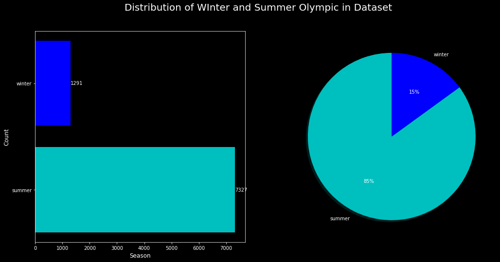
:::
:::

::: {.cell .code execution_count="24" execution="{\"iopub.status.busy\":\"2022-05-31T17:17:05.918399Z\",\"shell.execute_reply.started\":\"2022-05-31T17:17:05.918742Z\",\"iopub.status.idle\":\"2022-05-31T17:17:06.281144Z\",\"iopub.execute_input\":\"2022-05-31T17:17:05.918775Z\",\"shell.execute_reply\":\"2022-05-31T17:17:06.280301Z\"}" trusted="true"}
``` {.python}
# distribution of player in each olympic
total_cont=df1.year.value_counts()
label=total_cont.index
values=total_cont.values.flatten()
#pie plot
cols = ['c', 'b', 'r', 'k']
fig, axs = plt.subplots(1, 2, figsize=(17, 8))
axs[0].barh(label, values,color = cols)
axs[0].set_ylabel( "Count" , size = 12 )
# Set label for y-axis
axs[0].set_xlabel( "Olympic" , size = 12 )
plt.style.use('dark_background')
axs[1].pie(values, labels=label, colors = cols, startangle = 90, shadow = True, autopct='%1.0f%%', explode = (0,0,0,0,0,0,0))
fig.suptitle('Distribution of Olympic Year Wise',).set_size(20)
axs[0].grid(False)
axs[0].bar_label(axs[0].containers[0])

plt.style.use('dark_background')
plt.show()
```

::: {.output .display_data}
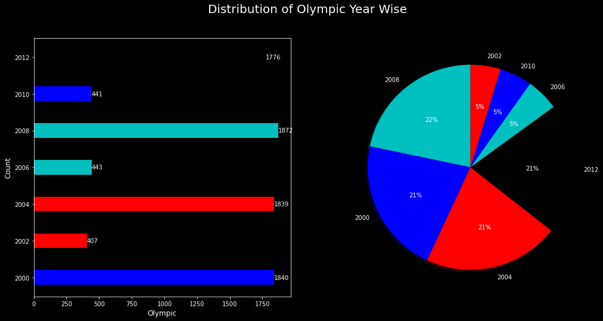
:::
:::

::: {.cell .code execution_count="25" execution="{\"iopub.status.busy\":\"2022-05-31T17:17:06.282578Z\",\"shell.execute_reply.started\":\"2022-05-31T17:17:06.282977Z\",\"iopub.status.idle\":\"2022-05-31T17:17:06.543152Z\",\"iopub.execute_input\":\"2022-05-31T17:17:06.283018Z\",\"shell.execute_reply\":\"2022-05-31T17:17:06.542153Z\"}" trusted="true"}
``` {.python}
plt.figure(figsize=(15,8))
ax = sns.boxplot(y="gold_medal", x="year", data=df1)
sns.set_style("dark")
```

::: {.output .display_data}
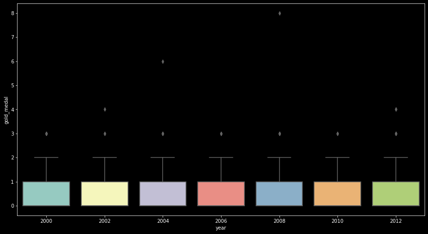
:::
:::

::: {.cell .code execution_count="26" execution="{\"iopub.status.busy\":\"2022-05-31T17:17:06.546363Z\",\"shell.execute_reply.started\":\"2022-05-31T17:17:06.546568Z\",\"iopub.status.idle\":\"2022-05-31T17:17:07.125194Z\",\"iopub.execute_input\":\"2022-05-31T17:17:06.546595Z\",\"shell.execute_reply\":\"2022-05-31T17:17:07.123959Z\"}" trusted="true"}
``` {.python}
df1.groupby('country').agg({'name':'nunique','total_medal':'sum'}).sort_values(by='total_medal',ascending=False)[:25].plot(kind='bar',figsize=(20,10),title='Number of Player vis Number of Total Medal Per Country')
sns.set_style("dark")
```

::: {.output .display_data}
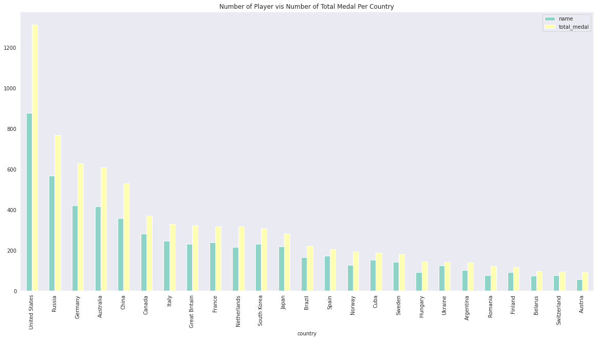
:::
:::

::: {.cell .code execution_count="27" execution="{\"iopub.status.busy\":\"2022-05-31T17:17:07.126517Z\",\"shell.execute_reply.started\":\"2022-05-31T17:17:07.126794Z\",\"iopub.status.idle\":\"2022-05-31T17:17:07.721893Z\",\"iopub.execute_input\":\"2022-05-31T17:17:07.126830Z\",\"shell.execute_reply\":\"2022-05-31T17:17:07.721069Z\"}" trusted="true"}
``` {.python}
df1.groupby(['sports']).size().sort_values(ascending=True).plot(kind = "barh",figsize=(20, 15),title='Distribution Of Sports')# horizontal bar plot
sns.set_style("dark")
```

::: {.output .display_data}
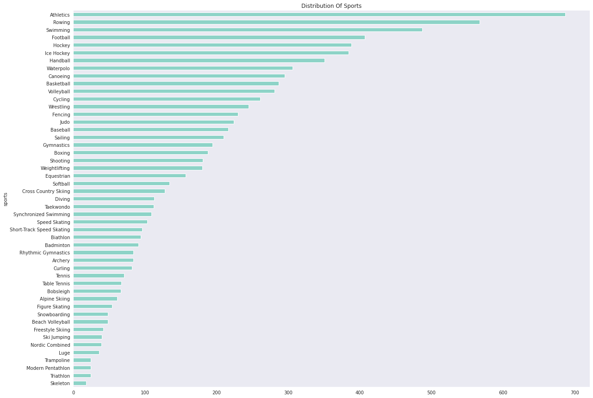
:::
:::

::: {.cell .markdown}
# 6. Please check if the age dataset is skewed or symmetric. Based on results perform transformation. {#6-please-check-if-the-age-dataset-is-skewed-or-symmetric-based-on-results-perform-transformation}
:::

::: {.cell .code execution_count="28" execution="{\"iopub.status.busy\":\"2022-05-31T17:17:07.723260Z\",\"shell.execute_reply.started\":\"2022-05-31T17:17:07.723446Z\",\"iopub.status.idle\":\"2022-05-31T17:17:08.104924Z\",\"iopub.execute_input\":\"2022-05-31T17:17:07.723472Z\",\"shell.execute_reply\":\"2022-05-31T17:17:08.104099Z\"}" trusted="true"}
``` {.python}
sns.set(rc={'figure.figsize':(11.7,8.27)})# figure size
sns.set_theme(style="whitegrid")
sns.histplot(olympic['age'], kde=True, color='red', bins=30)# histogram plot
plt.title('Age Distribution', fontsize=18)
plt.xlabel('Age', fontsize=16)
plt.ylabel('Count', fontsize=16)
plt.axvline(x=olympic['age'].mean(),color='green',label='mean')# mean line
plt.axvline(x=olympic['age'].median(),color='blue',ls='--',lw=2.5,label='medain')# medain line
plt.legend();
```

::: {.output .display_data}
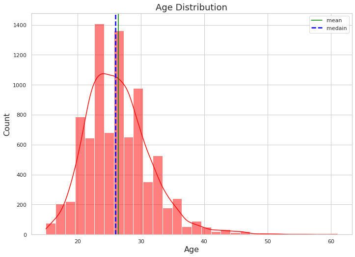
:::
:::

::: {.cell .markdown}
age data is right skewed.
:::

::: {.cell .code execution_count="29" execution="{\"iopub.status.busy\":\"2022-05-31T17:17:08.106083Z\",\"shell.execute_reply.started\":\"2022-05-31T17:17:08.106294Z\",\"iopub.status.idle\":\"2022-05-31T17:17:08.112973Z\",\"iopub.execute_input\":\"2022-05-31T17:17:08.106324Z\",\"shell.execute_reply\":\"2022-05-31T17:17:08.112161Z\"}" trusted="true"}
``` {.python}
olympic['age'].skew()# skewnwss
```

::: {.output .execute_result execution_count="29"}
    0.8590070668484233
:::
:::

::: {.cell .code execution_count="30" execution="{\"iopub.status.busy\":\"2022-05-31T17:17:08.114562Z\",\"shell.execute_reply.started\":\"2022-05-31T17:17:08.114807Z\",\"iopub.status.idle\":\"2022-05-31T17:17:08.128001Z\",\"iopub.execute_input\":\"2022-05-31T17:17:08.114847Z\",\"shell.execute_reply\":\"2022-05-31T17:17:08.127281Z\"}" trusted="true"}
``` {.python}
print('Skewness in Summmer Game in Age Attribute :',summer['age'].skew())# skewnwss
print('Skewness in Summmer Game in Age Attribute :',winter['age'].skew())# skewnwss
```

::: {.output .stream .stdout}
    Skewness in Summmer Game in Age Attribute : 0.9406258615029625
    Skewness in Summmer Game in Age Attribute : 0.4289162646610329
:::
:::

::: {.cell .markdown}
## Observation {#observation}

-   Summer olympic age attribur age is moderately skewed.Because If the
    skewness is between -1 and -- 0.5 or between 0.5 and 1, the data are
    moderately skewed.
-   Winter olympic age attribur age is fairly symmetrical.Because If the
    skewness is between -0.5 and 0.5, the data are fairly symmetrical
:::

::: {.cell .code execution_count="31" execution="{\"iopub.status.busy\":\"2022-05-31T17:17:08.129460Z\",\"shell.execute_reply.started\":\"2022-05-31T17:17:08.129975Z\",\"iopub.status.idle\":\"2022-05-31T17:17:10.243398Z\",\"iopub.execute_input\":\"2022-05-31T17:17:08.130017Z\",\"shell.execute_reply\":\"2022-05-31T17:17:10.242499Z\"}" trusted="true"}
``` {.python}
# istogram and density plot 
ax=sns.displot(
    olympic, x="age", col="year",
    binwidth=3, height=5, facet_kws=dict(margin_titles=True),col_wrap=3,discrete=True,stat="frequency"
)
for axis in ax.axes.flat:
    axis.tick_params(labelleft=True)
    axis.tick_params(labelbottom=True)
ax.fig.subplots_adjust(top=0.9) # adjust the Figure
ax.fig.suptitle('Distribtion of Age in different Year')
```

::: {.output .execute_result execution_count="31"}
    Text(0.5, 0.98, 'Distribtion of Age in different Year')
:::

::: {.output .display_data}
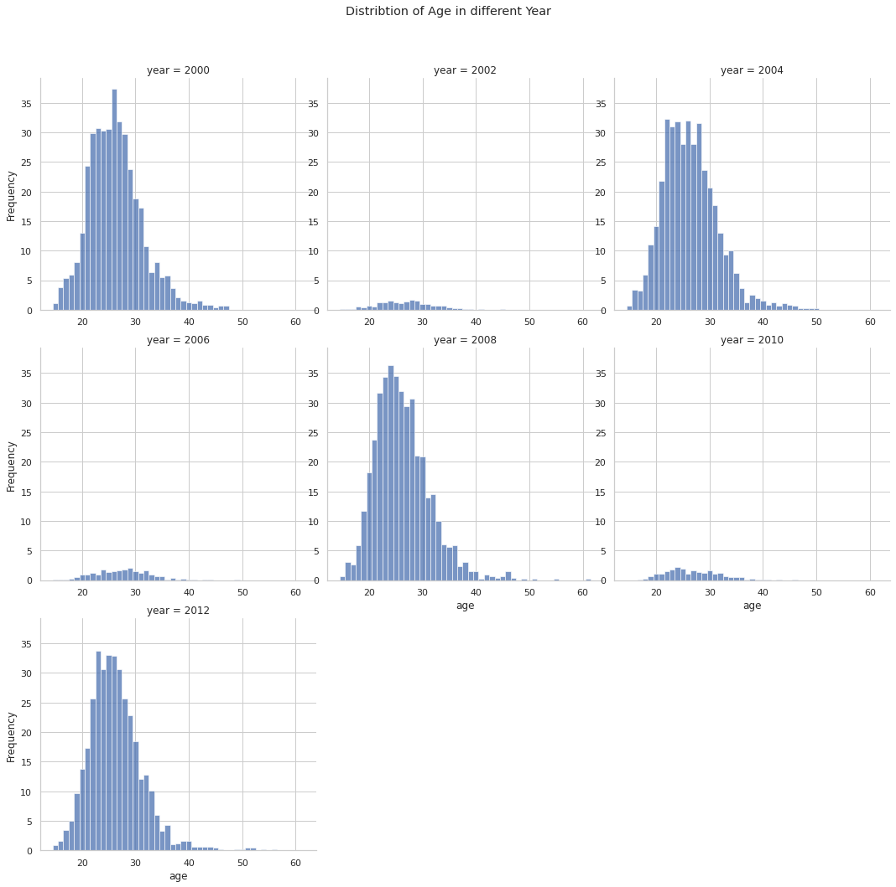
:::
:::

::: {.cell .markdown}
## Observation: {#observation}

2008 and 2012 year has most skeweed and lot of outlier on tail side.
:::

::: {.cell .code execution_count="32" execution="{\"iopub.status.busy\":\"2022-05-31T17:17:10.244562Z\",\"shell.execute_reply.started\":\"2022-05-31T17:17:10.244785Z\",\"iopub.status.idle\":\"2022-05-31T17:17:10.265585Z\",\"iopub.execute_input\":\"2022-05-31T17:17:10.244833Z\",\"shell.execute_reply\":\"2022-05-31T17:17:10.264587Z\"}" trusted="true"}
``` {.python}
summer_2008[summer_2008['age']>=45]# grater than 45 filter
```

::: {.output .execute_result execution_count="32"}
```{=html}
<div>
<style scoped>
    .dataframe tbody tr th:only-of-type {
        vertical-align: middle;
    }

    .dataframe tbody tr th {
        vertical-align: top;
    }

    .dataframe thead th {
        text-align: right;
    }
</style>
<table border="1" class="dataframe">
  <thead>
    <tr style="text-align: right;">
      <th></th>
      <th>name</th>
      <th>age</th>
      <th>country</th>
      <th>year</th>
      <th>Date_Given</th>
      <th>sports</th>
      <th>gold_medal</th>
      <th>silver_medal</th>
      <th>brone_medal</th>
      <th>total_medal</th>
      <th>month</th>
      <th>season</th>
    </tr>
  </thead>
  <tbody>
    <tr>
      <th>438</th>
      <td>Heike Kemmer</td>
      <td>46.0</td>
      <td>Germany</td>
      <td>2008</td>
      <td>2008-08-24</td>
      <td>Equestrian</td>
      <td>1</td>
      <td>0</td>
      <td>1</td>
      <td>2</td>
      <td>8</td>
      <td>summer</td>
    </tr>
    <tr>
      <th>441</th>
      <td>Hinrich Romeike</td>
      <td>45.0</td>
      <td>Germany</td>
      <td>2008</td>
      <td>2008-08-24</td>
      <td>Equestrian</td>
      <td>2</td>
      <td>0</td>
      <td>0</td>
      <td>2</td>
      <td>8</td>
      <td>summer</td>
    </tr>
    <tr>
      <th>2815</th>
      <td>Rajmond Debevec</td>
      <td>45.0</td>
      <td>Slovenia</td>
      <td>2008</td>
      <td>2008-08-24</td>
      <td>Shooting</td>
      <td>0</td>
      <td>0</td>
      <td>1</td>
      <td>1</td>
      <td>8</td>
      <td>summer</td>
    </tr>
    <tr>
      <th>2834</th>
      <td>Warren Potent</td>
      <td>46.0</td>
      <td>Australia</td>
      <td>2008</td>
      <td>2008-08-24</td>
      <td>Shooting</td>
      <td>0</td>
      <td>0</td>
      <td>1</td>
      <td>1</td>
      <td>8</td>
      <td>summer</td>
    </tr>
    <tr>
      <th>2839</th>
      <td>Ralf Schumann</td>
      <td>46.0</td>
      <td>Germany</td>
      <td>2008</td>
      <td>2008-08-24</td>
      <td>Shooting</td>
      <td>0</td>
      <td>1</td>
      <td>0</td>
      <td>1</td>
      <td>8</td>
      <td>summer</td>
    </tr>
    <tr>
      <th>3005</th>
      <td>Santiago Lange</td>
      <td>46.0</td>
      <td>Argentina</td>
      <td>2008</td>
      <td>2008-08-24</td>
      <td>Sailing</td>
      <td>0</td>
      <td>0</td>
      <td>1</td>
      <td>1</td>
      <td>8</td>
      <td>summer</td>
    </tr>
    <tr>
      <th>6096</th>
      <td>Rolf-Göran Bengtsson</td>
      <td>46.0</td>
      <td>Sweden</td>
      <td>2008</td>
      <td>2008-08-24</td>
      <td>Equestrian</td>
      <td>0</td>
      <td>1</td>
      <td>0</td>
      <td>1</td>
      <td>8</td>
      <td>summer</td>
    </tr>
    <tr>
      <th>6098</th>
      <td>Mac Cone</td>
      <td>55.0</td>
      <td>Canada</td>
      <td>2008</td>
      <td>2008-08-24</td>
      <td>Equestrian</td>
      <td>0</td>
      <td>1</td>
      <td>0</td>
      <td>1</td>
      <td>8</td>
      <td>summer</td>
    </tr>
    <tr>
      <th>6106</th>
      <td>Jill Henselwood</td>
      <td>45.0</td>
      <td>Canada</td>
      <td>2008</td>
      <td>2008-08-24</td>
      <td>Equestrian</td>
      <td>0</td>
      <td>1</td>
      <td>0</td>
      <td>1</td>
      <td>8</td>
      <td>summer</td>
    </tr>
    <tr>
      <th>6108</th>
      <td>Anne Jensen-van Olst</td>
      <td>46.0</td>
      <td>Denmark</td>
      <td>2008</td>
      <td>2008-08-24</td>
      <td>Equestrian</td>
      <td>0</td>
      <td>0</td>
      <td>1</td>
      <td>1</td>
      <td>8</td>
      <td>summer</td>
    </tr>
    <tr>
      <th>6115</th>
      <td>Ian Millar</td>
      <td>61.0</td>
      <td>Canada</td>
      <td>2008</td>
      <td>2008-08-24</td>
      <td>Equestrian</td>
      <td>0</td>
      <td>1</td>
      <td>0</td>
      <td>1</td>
      <td>8</td>
      <td>summer</td>
    </tr>
    <tr>
      <th>6121</th>
      <td>Pius Schwizer</td>
      <td>46.0</td>
      <td>Switzerland</td>
      <td>2008</td>
      <td>2008-08-24</td>
      <td>Equestrian</td>
      <td>0</td>
      <td>0</td>
      <td>1</td>
      <td>1</td>
      <td>8</td>
      <td>summer</td>
    </tr>
    <tr>
      <th>6122</th>
      <td>Will Simpson</td>
      <td>49.0</td>
      <td>United States</td>
      <td>2008</td>
      <td>2008-08-24</td>
      <td>Equestrian</td>
      <td>1</td>
      <td>0</td>
      <td>0</td>
      <td>1</td>
      <td>8</td>
      <td>summer</td>
    </tr>
    <tr>
      <th>6123</th>
      <td>Peter Thomsen</td>
      <td>47.0</td>
      <td>Germany</td>
      <td>2008</td>
      <td>2008-08-24</td>
      <td>Equestrian</td>
      <td>1</td>
      <td>0</td>
      <td>0</td>
      <td>1</td>
      <td>8</td>
      <td>summer</td>
    </tr>
    <tr>
      <th>6124</th>
      <td>Mary Thomson-King</td>
      <td>47.0</td>
      <td>Great Britain</td>
      <td>2008</td>
      <td>2008-08-24</td>
      <td>Equestrian</td>
      <td>0</td>
      <td>0</td>
      <td>1</td>
      <td>1</td>
      <td>8</td>
      <td>summer</td>
    </tr>
    <tr>
      <th>8569</th>
      <td>Ilario Di Buò</td>
      <td>51.0</td>
      <td>Italy</td>
      <td>2008</td>
      <td>2008-08-24</td>
      <td>Archery</td>
      <td>0</td>
      <td>1</td>
      <td>0</td>
      <td>1</td>
      <td>8</td>
      <td>summer</td>
    </tr>
  </tbody>
</table>
</div>
```
:::
:::

::: {.cell .markdown}
## Observation {#observation}

Now its time to check reason behind skewnness in dataset.So , we got our
reason behind it. Basically two sports Equestrian and Archery may be
behing overall skewness of dataset. Another natural question came to
mind , why average age of Equestrian players is more as compare to
other.Than I found this , What is the average age of equestrian riders?
With a median age of 36, equestrians are the oldest Olympians. More
sedate sports also tend to have older athletes; golf and shooting are
near the top of the list. So,Eqestrain can behave as outlier in our
dataset.we had to came up with effective streatgy to deal with it.
:::

::: {.cell .code execution_count="33" execution="{\"iopub.status.busy\":\"2022-05-31T17:17:10.267300Z\",\"shell.execute_reply.started\":\"2022-05-31T17:17:10.267788Z\",\"iopub.status.idle\":\"2022-05-31T17:17:10.278001Z\",\"iopub.execute_input\":\"2022-05-31T17:17:10.267833Z\",\"shell.execute_reply\":\"2022-05-31T17:17:10.277246Z\"}" trusted="true"}
``` {.python}
olympic[olympic['sports']=='Equestrian']['total_medal'].sum()#sum of medal with condition
```

::: {.output .execute_result execution_count="33"}
    182
:::
:::

::: {.cell .markdown}
## Observation {#observation}

Next thing came in my why can not we just delete it.But we can not when
I found that Equestran sports overall gain 182 medals in this olympic.It
can lead to huge data loose.SO, we had to go with another affective
approach.
:::

::: {.cell .code execution_count="34" execution="{\"iopub.status.busy\":\"2022-05-31T17:17:10.279493Z\",\"shell.execute_reply.started\":\"2022-05-31T17:17:10.280601Z\",\"iopub.status.idle\":\"2022-05-31T17:17:10.289894Z\",\"iopub.execute_input\":\"2022-05-31T17:17:10.280647Z\",\"shell.execute_reply\":\"2022-05-31T17:17:10.289087Z\"}" trusted="true"}
``` {.python}
olympic[olympic['sports']!='Equestrian']['age'].skew()#skewness with condition
```

::: {.output .execute_result execution_count="34"}
    0.5893075827643961
:::
:::

::: {.cell .markdown}
## Observation {#observation}

I try to check skewness without equestrian .So it lead to huge decrease
in skewness in our dataset.So, we also found it our culprit for skewness
also.But we can not delete it. Skewness Result Interpretaion - If the
skewness is between -1 and -- 0.5 or between 0.5 and 1, the data are
moderately skewed. If the skewness is less than -1 or greater than 1,
the data are highly skewed.
:::

::: {.cell .markdown}
## Transformation on Age Column
:::

::: {.cell .code execution_count="35" execution="{\"iopub.status.busy\":\"2022-05-31T17:17:10.292317Z\",\"shell.execute_reply.started\":\"2022-05-31T17:17:10.293456Z\",\"iopub.status.idle\":\"2022-05-31T17:17:11.010047Z\",\"iopub.execute_input\":\"2022-05-31T17:17:10.293491Z\",\"shell.execute_reply\":\"2022-05-31T17:17:11.009032Z\"}" trusted="true"}
``` {.python}
fig, ax = plt.subplots(1,2,figsize=(20,6))
plt.suptitle('DISTRIBUTION PLOTS')
# Histogram Plot for distribution and skewness
sns.histplot(olympic['age'], kde=True, color='red', bins=8,ax=ax[0]) #Age
plt.title('Age Distribution', fontsize=18)
plt.xlabel('Age', fontsize=16)
plt.ylabel('Count', fontsize=16)

sns.histplot(np.log(olympic['age']), kde=True, color='green', bins=8,ax=ax[1]) #log transformed Age 
plt.title('Age Distribution After Log Transformation', fontsize=18)
plt.xlabel('Age', fontsize=16)
plt.ylabel('Count', fontsize=16)

# Box Plot for 5-point summary , distribution and outliers

fig, ax = plt.subplots(1,2,figsize=(20,5))
plt.suptitle('BOX PLOTS')

sns.boxplot(data = olympic ,y=olympic['age'], color='red',ax=ax[0]) #Age
plt.title('Age box_Plot', fontsize=18)
plt.ylabel('Age', fontsize=16)

sns.boxplot(data = olympic ,y=np.log(olympic['age']), color='green',ax=ax[1]) #log transformed Age  
plt.title('log transformed Age box_Plot', fontsize=18)
plt.ylabel('Age', fontsize=16)
```

::: {.output .execute_result execution_count="35"}
    Text(0, 0.5, 'Age')
:::

::: {.output .display_data}
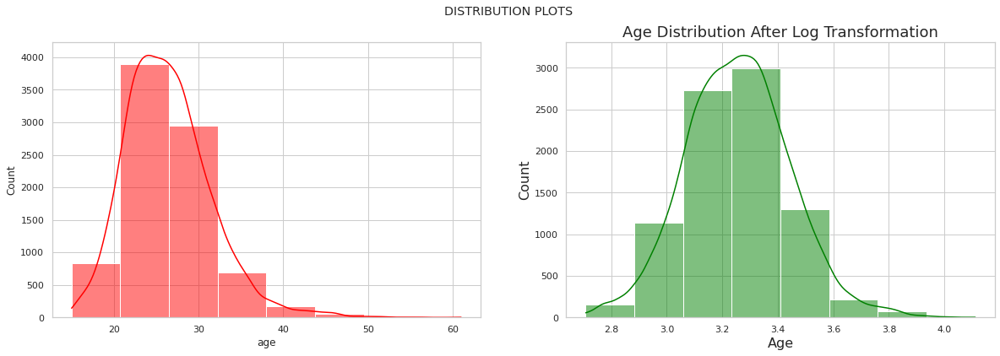
:::

::: {.output .display_data}
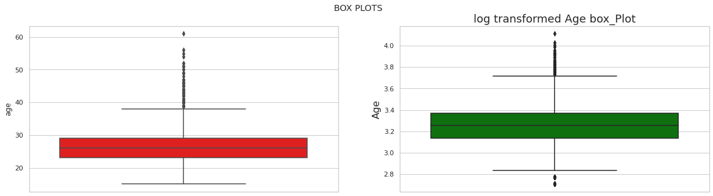
:::
:::

::: {.cell .markdown}
## 7. Please perform appropriate numerical measures on each column and report them accordingly. {#7-please-perform-appropriate-numerical-measures-on-each-column-and-report-them-accordingly}
:::

::: {.cell .markdown}
### Statistical Summary of Each Features
:::

::: {.cell .code execution_count="36" execution="{\"iopub.status.busy\":\"2022-05-31T17:17:11.011258Z\",\"shell.execute_reply.started\":\"2022-05-31T17:17:11.011835Z\",\"iopub.status.idle\":\"2022-05-31T17:17:11.043312Z\",\"iopub.execute_input\":\"2022-05-31T17:17:11.011886Z\",\"shell.execute_reply\":\"2022-05-31T17:17:11.042163Z\"}" trusted="true"}
``` {.python}
olympic.describe().round(0)# statistical summary of nummerical varriable and rounding of float values to zero
```

::: {.output .execute_result execution_count="36"}
```{=html}
<div>
<style scoped>
    .dataframe tbody tr th:only-of-type {
        vertical-align: middle;
    }

    .dataframe tbody tr th {
        vertical-align: top;
    }

    .dataframe thead th {
        text-align: right;
    }
</style>
<table border="1" class="dataframe">
  <thead>
    <tr style="text-align: right;">
      <th></th>
      <th>age</th>
      <th>gold_medal</th>
      <th>silver_medal</th>
      <th>brone_medal</th>
      <th>total_medal</th>
    </tr>
  </thead>
  <tbody>
    <tr>
      <th>count</th>
      <td>8613.0</td>
      <td>8613.0</td>
      <td>8613.0</td>
      <td>8613.0</td>
      <td>8613.0</td>
    </tr>
    <tr>
      <th>mean</th>
      <td>26.0</td>
      <td>0.0</td>
      <td>0.0</td>
      <td>0.0</td>
      <td>1.0</td>
    </tr>
    <tr>
      <th>std</th>
      <td>5.0</td>
      <td>1.0</td>
      <td>1.0</td>
      <td>1.0</td>
      <td>0.0</td>
    </tr>
    <tr>
      <th>min</th>
      <td>15.0</td>
      <td>0.0</td>
      <td>0.0</td>
      <td>0.0</td>
      <td>1.0</td>
    </tr>
    <tr>
      <th>25%</th>
      <td>23.0</td>
      <td>0.0</td>
      <td>0.0</td>
      <td>0.0</td>
      <td>1.0</td>
    </tr>
    <tr>
      <th>50%</th>
      <td>26.0</td>
      <td>0.0</td>
      <td>0.0</td>
      <td>0.0</td>
      <td>1.0</td>
    </tr>
    <tr>
      <th>75%</th>
      <td>29.0</td>
      <td>1.0</td>
      <td>1.0</td>
      <td>1.0</td>
      <td>1.0</td>
    </tr>
    <tr>
      <th>max</th>
      <td>61.0</td>
      <td>8.0</td>
      <td>3.0</td>
      <td>3.0</td>
      <td>8.0</td>
    </tr>
  </tbody>
</table>
</div>
```
:::
:::

::: {.cell .code execution_count="37" execution="{\"iopub.status.busy\":\"2022-05-31T17:17:11.044686Z\",\"shell.execute_reply.started\":\"2022-05-31T17:17:11.045357Z\",\"iopub.status.idle\":\"2022-05-31T17:17:11.065926Z\",\"iopub.execute_input\":\"2022-05-31T17:17:11.045398Z\",\"shell.execute_reply\":\"2022-05-31T17:17:11.065250Z\"}" trusted="true"}
``` {.python}
olympic.describe(include='object')# statistical summary of categorical  varriables
```

::: {.output .execute_result execution_count="37"}
```{=html}
<div>
<style scoped>
    .dataframe tbody tr th:only-of-type {
        vertical-align: middle;
    }

    .dataframe tbody tr th {
        vertical-align: top;
    }

    .dataframe thead th {
        text-align: right;
    }
</style>
<table border="1" class="dataframe">
  <thead>
    <tr style="text-align: right;">
      <th></th>
      <th>name</th>
      <th>New_name</th>
    </tr>
  </thead>
  <tbody>
    <tr>
      <th>count</th>
      <td>8613</td>
      <td>8613</td>
    </tr>
    <tr>
      <th>unique</th>
      <td>6955</td>
      <td>6954</td>
    </tr>
    <tr>
      <th>top</th>
      <td>Matt Wells</td>
      <td>Matt Wells</td>
    </tr>
    <tr>
      <th>freq</th>
      <td>4</td>
      <td>4</td>
    </tr>
  </tbody>
</table>
</div>
```
:::
:::

::: {.cell .markdown}
# Please list the top 10 countries with the gold medal, then top10 countries with the silver medal, then bronze medal and the total medal. {#please-list-the-top-10-countries-with-the-gold-medal-then-top10-countries-with-the-silver-medal-then-bronze-medal-and-the-total-medal}
:::

::: {.cell .code execution_count="38" execution="{\"iopub.status.busy\":\"2022-05-31T17:17:11.067365Z\",\"shell.execute_reply.started\":\"2022-05-31T17:17:11.067690Z\",\"iopub.status.idle\":\"2022-05-31T17:17:11.668833Z\",\"iopub.execute_input\":\"2022-05-31T17:17:11.067726Z\",\"shell.execute_reply\":\"2022-05-31T17:17:11.668013Z\"}" trusted="true"}
``` {.python}
total_cont=olympic.groupby('country')['total_medal'].sum().nlargest(10)# group by country and sum with top 10
label=total_cont.index
values=total_cont.values.flatten()
cols = ['c', 'b', 'r', 'k']
fig, axs = plt.subplots(1, 2, figsize=(17, 8))
axs[0].barh(label, values,color = cols)# horzontal bar plot
axs[0].set_ylabel( "Counteries" , size = 12 )
# Set label for y-axis
axs[0].set_xlabel( "Number Of Medals" , size = 12 )
plt.style.use('dark_background')
#pie plot
axs[1].pie(values, labels=label, colors = cols, startangle = 90, shadow = True, autopct='%1.0f%%', explode = (0, 0, 0, 0,0, 0, 0, 0,0,0))
fig.suptitle('Top 10 countries with the Total medal',).set_size(20)# main title
axs[0].grid(False)
axs[0].bar_label(axs[0].containers[0])
plt.style.use('dark_background')# background
plt.show()
```

::: {.output .display_data}
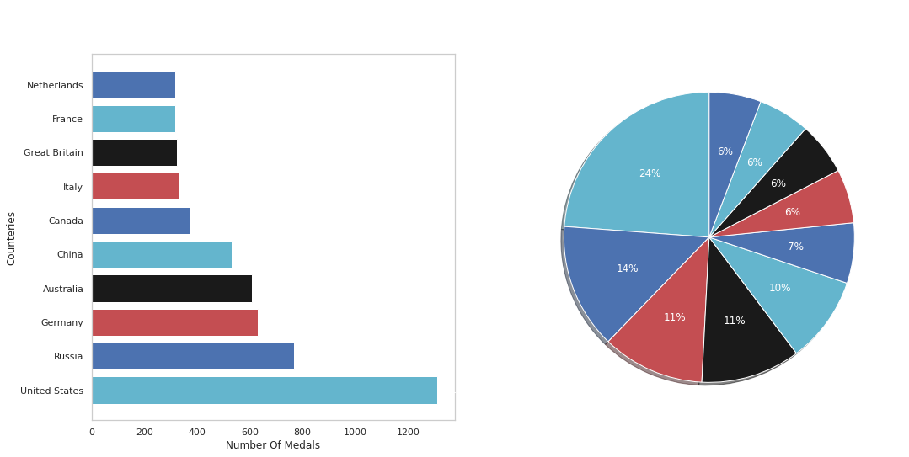
:::
:::

::: {.cell .code execution_count="39" execution="{\"iopub.status.busy\":\"2022-05-31T17:17:11.670449Z\",\"shell.execute_reply.started\":\"2022-05-31T17:17:11.670885Z\",\"iopub.status.idle\":\"2022-05-31T17:17:12.126205Z\",\"iopub.execute_input\":\"2022-05-31T17:17:11.670939Z\",\"shell.execute_reply\":\"2022-05-31T17:17:12.125152Z\"}" trusted="true"}
``` {.python}
gold_cont=olympic.groupby('country')['gold_medal'].sum().nlargest(10)# group by country and sum with top 10
label=gold_cont.index
values=gold_cont.values.flatten()
#pie plot
cols = ['c', 'b', 'r', 'k']
fig, axs = plt.subplots(1, 2, figsize=(17, 8))
axs[0].barh(label, values,color = cols)# horzontal bar plot
axs[0].set_ylabel( "Counteries" , size = 12 )
# Set label for y-axis
axs[0].set_xlabel( "Number Of Medals" , size = 12 )
plt.style.use('dark_background')# setting backgorund
#pie plot
axs[1].pie(values, labels=label, colors = cols, startangle = 90, shadow = True, autopct='%1.0f%%', explode = (0, 0, 0, 0,0, 0, 0, 0,0,0))
fig.suptitle('Top 10 countries with the Gold medal',).set_size(20)# title
axs[0].grid(False)
axs[0].bar_label(axs[0].containers[0])
plt.style.use('dark_background')
plt.show()
```

::: {.output .display_data}
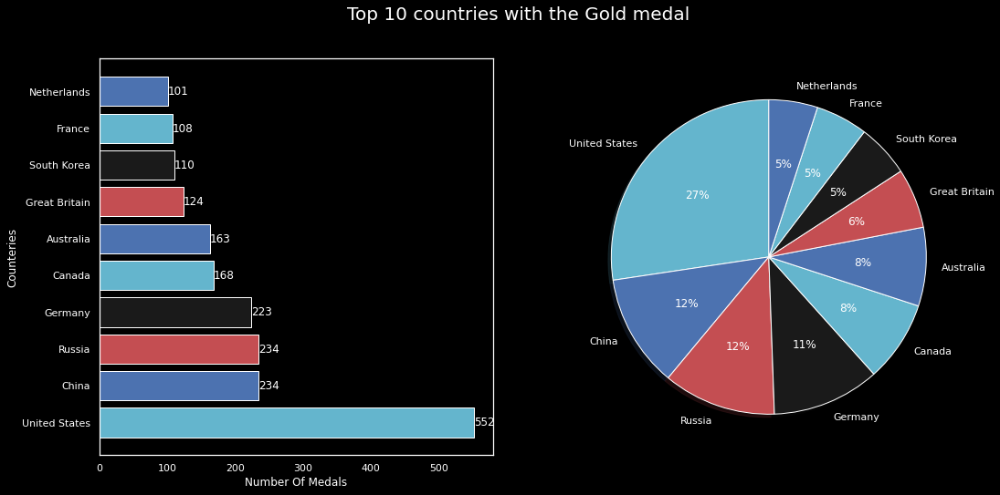
:::
:::

::: {.cell .code execution_count="40" execution="{\"iopub.status.busy\":\"2022-05-31T17:17:12.127323Z\",\"shell.execute_reply.started\":\"2022-05-31T17:17:12.127500Z\",\"iopub.status.idle\":\"2022-05-31T17:17:12.571829Z\",\"iopub.execute_input\":\"2022-05-31T17:17:12.127526Z\",\"shell.execute_reply\":\"2022-05-31T17:17:12.571012Z\"}" trusted="true"}
``` {.python}
silv_cont=olympic.groupby('country')['silver_medal'].sum().nlargest(10) # group by country and sum with top 10
label=silv_cont.index
values=silv_cont.values.flatten()
cols = ['c', 'b', 'r', 'k']
fig, axs = plt.subplots(1, 2, figsize=(17, 8))
axs[0].barh(label, values,color = cols)# horzontal bar plot
axs[0].set_ylabel( "Counteries" , size = 12 )
# Set label for y-axis
axs[0].set_xlabel( "Number Of Medals" , size = 12 )
plt.style.use('dark_background')# setting backgorund
#pie plot
axs[1].pie(values, labels=label, colors = cols, startangle = 90, shadow = True, autopct='%1.0f%%', explode = (0, 0, 0, 0,0, 0, 0, 0,0,0))
fig.suptitle('Top 10 countries with the Silver Medal',).set_size(20)# main title
axs[0].grid(False)
axs[0].bar_label(axs[0].containers[0])
plt.style.use('dark_background')
plt.show()
```

::: {.output .display_data}
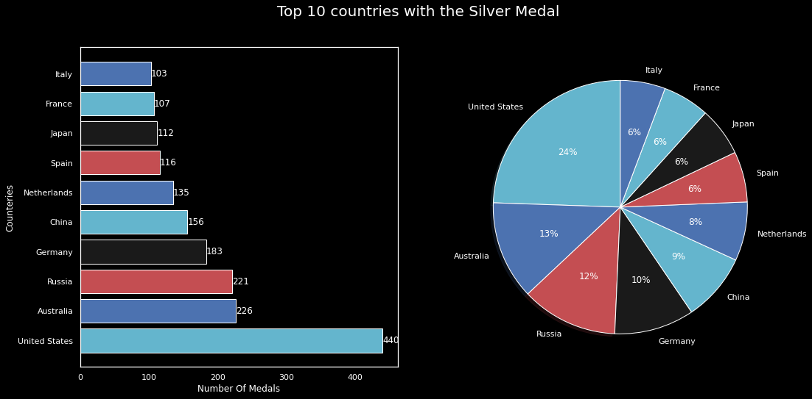
:::
:::

::: {.cell .code execution_count="41" execution="{\"iopub.status.busy\":\"2022-05-31T17:17:12.575869Z\",\"shell.execute_reply.started\":\"2022-05-31T17:17:12.576110Z\",\"iopub.status.idle\":\"2022-05-31T17:17:13.072612Z\",\"iopub.execute_input\":\"2022-05-31T17:17:12.576143Z\",\"shell.execute_reply\":\"2022-05-31T17:17:13.071846Z\"}" trusted="true"}
``` {.python}
bronze_cont=olympic.groupby('country')['brone_medal'].sum().nlargest(10) # group by country and sum with top 10

label=bronze_cont.index
values=bronze_cont.values.flatten()
cols = ['c', 'b', 'r', 'k']
fig, axs = plt.subplots(1, 2, figsize=(17, 8))
axs[0].barh(label, values,color = cols)# horzontal bar plot
axs[0].set_ylabel( "Counteries" , size = 12 )
# Set label for y-axis
axs[0].set_xlabel( "Number Of Medals" , size = 12 )
plt.style.use('dark_background')# setting backgorund
#pie plot
axs[1].pie(values, labels=label, colors = cols, startangle = 90, shadow = True, autopct='%1.0f%%', explode = (0, 0, 0, 0,0, 0, 0, 0,0,0))
fig.suptitle('Top 10 countries with the Bronze medal',).set_size(20)# main title
axs[0].grid(False)
axs[0].bar_label(axs[0].containers[0])
plt.style.use('dark_background')
plt.show()
```

::: {.output .display_data}
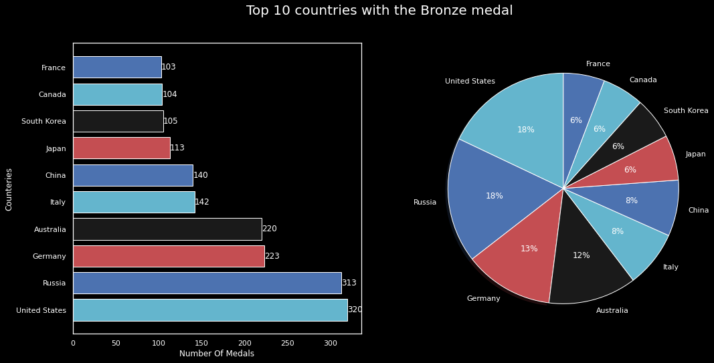
:::
:::

::: {.cell .code execution_count="42" execution="{\"iopub.status.busy\":\"2022-05-31T17:17:13.073904Z\",\"shell.execute_reply.started\":\"2022-05-31T17:17:13.074337Z\",\"iopub.status.idle\":\"2022-05-31T17:17:13.148987Z\",\"iopub.execute_input\":\"2022-05-31T17:17:13.074368Z\",\"shell.execute_reply\":\"2022-05-31T17:17:13.148309Z\"}" trusted="true"}
``` {.python}
olympic.to_csv('new_olympic.csv',index=False)# final output after cleaning 
```
:::

::: {.cell .markdown}
# Pyspark
:::

::: {.cell .code execution_count="43" execution="{\"iopub.status.busy\":\"2022-05-31T17:17:13.150074Z\",\"shell.execute_reply.started\":\"2022-05-31T17:17:13.150390Z\",\"iopub.status.idle\":\"2022-05-31T17:17:13.154290Z\",\"iopub.execute_input\":\"2022-05-31T17:17:13.150420Z\",\"shell.execute_reply\":\"2022-05-31T17:17:13.153269Z\"}" trusted="true"}
``` {.python}
# !pip install pyspark --target=/kaggle/working/mysitepackages
```
:::

::: {.cell .code execution_count="64" execution="{\"iopub.status.busy\":\"2022-05-31T17:32:18.697337Z\",\"shell.execute_reply.started\":\"2022-05-31T17:32:18.697651Z\",\"iopub.status.idle\":\"2022-05-31T17:32:18.702944Z\",\"iopub.execute_input\":\"2022-05-31T17:32:18.697686Z\",\"shell.execute_reply\":\"2022-05-31T17:32:18.702122Z\"}" trusted="true"}
``` {.python}
#creating pyspark session
from pyspark import SparkConf
from pyspark.sql import SparkSession
#importing pyspark sql function
from pyspark.sql.functions import sum, col, desc, asc, count
```
:::

::: {.cell .code execution_count="65" execution="{\"iopub.status.busy\":\"2022-05-31T17:32:18.887134Z\",\"shell.execute_reply.started\":\"2022-05-31T17:32:18.887410Z\",\"iopub.status.idle\":\"2022-05-31T17:32:18.917850Z\",\"iopub.execute_input\":\"2022-05-31T17:32:18.887444Z\",\"shell.execute_reply\":\"2022-05-31T17:32:18.916892Z\"}" trusted="true"}
``` {.python}
#bulding pyspark app
spark = SparkSession.builder.appName("practice").getOrCreate()
spark.sparkContext.getConf().getAll();
```
:::

::: {.cell .markdown}
1.  Write PySpark code to read olympix_data.csv file
2.  Write PySpark code to print the Olympic Sports/games in the dataset.
3.  Write PySpark code to plot the total number of medals in each
    Olympic Sport/game
4.  Sort the result based on the total number of medals.
5.  Find the total number of medals won by each country in swimming.
6.  Find the total number of medals won by each country in Skeleton.
7.  Find the number of medals that the US won yearly.
8.  Find the total number of medals won by each country.
9.  Who was the oldest athlete in the olympics?
10. Which country was he/she from?
:::

::: {.cell .markdown}
# Write PySpark code to read olympix_data.csv file {#write-pyspark-code-to-read-olympix_datacsv-file}
:::

::: {.cell .code execution_count="66" execution="{\"iopub.status.busy\":\"2022-05-31T17:32:18.989412Z\",\"shell.execute_reply.started\":\"2022-05-31T17:32:18.989707Z\",\"iopub.status.idle\":\"2022-05-31T17:32:19.590124Z\",\"iopub.execute_input\":\"2022-05-31T17:32:18.989745Z\",\"shell.execute_reply\":\"2022-05-31T17:32:19.589157Z\"}" trusted="true"}
``` {.python}
df = spark.read.csv(file_location,header=True,inferSchema='True') # reading fil ewith help of pyspark 
```
:::

::: {.cell .code execution_count="67" execution="{\"iopub.status.busy\":\"2022-05-31T17:32:19.591957Z\",\"shell.execute_reply.started\":\"2022-05-31T17:32:19.592249Z\",\"iopub.status.idle\":\"2022-05-31T17:32:20.733124Z\",\"iopub.execute_input\":\"2022-05-31T17:32:19.592292Z\",\"shell.execute_reply\":\"2022-05-31T17:32:20.732176Z\"}" trusted="true"}
``` {.python}
# reading panda datafram with pyspark 
sparkDF=spark.createDataFrame(olympic) 
# schema of pyspark
sparkDF.printSchema()
# first five row of pyspark dataframe
sparkDF.show()
```

::: {.output .stream .stdout}
    root
     |-- name: string (nullable = true)
     |-- age: double (nullable = true)
     |-- country: string (nullable = true)
     |-- year: long (nullable = true)
     |-- Date_Given: timestamp (nullable = true)
     |-- sports: string (nullable = true)
     |-- gold_medal: long (nullable = true)
     |-- silver_medal: long (nullable = true)
     |-- brone_medal: long (nullable = true)
     |-- total_medal: long (nullable = true)
     |-- New_name: string (nullable = true)

    +--------------------+----+-------------+----+-------------------+--------------------+----------+------------+-----------+-----------+--------------------+
    |                name| age|      country|year|         Date_Given|              sports|gold_medal|silver_medal|brone_medal|total_medal|            New_name|
    +--------------------+----+-------------+----+-------------------+--------------------+----------+------------+-----------+-----------+--------------------+
    |      Michael Phelps|23.0|United States|2008|2008-08-24 00:00:00|            Swimming|         8|           0|          0|          8|      Michael Phelps|
    |      Michael Phelps|19.0|United States|2004|2004-08-29 00:00:00|            Swimming|         6|           0|          2|          8|      Michael Phelps|
    |      Michael Phelps|27.0|United States|2012|2012-08-12 00:00:00|            Swimming|         4|           2|          0|          6|      Michael Phelps|
    |    Natalie Coughlin|25.0|United States|2008|2008-08-24 00:00:00|            Swimming|         1|           2|          3|          6|    Natalie Coughlin|
    |       Aleksey Nemov|24.0|       Russia|2000|2000-10-01 00:00:00|          Gymnastics|         2|           1|          3|          6|       Aleksey Nemov|
    |       Alicia Coutts|24.0|    Australia|2012|2012-08-12 00:00:00|            Swimming|         1|           3|          1|          5|       Alicia Coutts|
    |      Missy Franklin|17.0|United States|2012|2012-08-12 00:00:00|            Swimming|         4|           0|          1|          5|      Missy Franklin|
    |         Ryan Lochte|27.0|United States|2012|2012-08-12 00:00:00|            Swimming|         2|           2|          1|          5|         Ryan Lochte|
    |     Allison Schmitt|22.0|United States|2012|2012-08-12 00:00:00|            Swimming|         3|           1|          1|          5|     Allison Schmitt|
    |    Natalie Coughlin|21.0|United States|2004|2004-08-29 00:00:00|            Swimming|         2|           2|          1|          5|    Natalie Coughlin|
    |          Ian Thorpe|17.0|    Australia|2000|2000-10-01 00:00:00|            Swimming|         3|           2|          0|          5|          Ian Thorpe|
    |         Dara Torres|33.0|United States|2000|2000-10-01 00:00:00|            Swimming|         2|           0|          3|          5|         Dara Torres|
    |       Cindy Klassen|26.0|       Canada|2006|2006-02-26 00:00:00|       Speed Skating|         1|           2|          2|          5|       Cindy Klassen|
    |       Nastia Liukin|18.0|United States|2008|2008-08-24 00:00:00|          Gymnastics|         1|           3|          1|          5|       Nastia Liukin|
    |       Marit Bjørgen|29.0|       Norway|2010|2010-02-28 00:00:00|Cross Country Skiing|         3|           1|          1|          5|       Marit Bjorgen|
    |            Sun Yang|20.0|        China|2012|2012-08-12 00:00:00|            Swimming|         2|           1|          1|          4|            Sun Yang|
    |     Kirsty Coventry|24.0|     Zimbabwe|2008|2008-08-24 00:00:00|            Swimming|         1|           3|          0|          4|     Kirsty Coventry|
    |Libby Lenton-Tric...|23.0|    Australia|2008|2008-08-24 00:00:00|            Swimming|         2|           1|          1|          4|Libby Lenton Tric...|
    |         Ryan Lochte|24.0|United States|2008|2008-08-24 00:00:00|            Swimming|         2|           0|          2|          4|         Ryan Lochte|
    |      Inge de Bruijn|30.0|  Netherlands|2004|2004-08-29 00:00:00|            Swimming|         1|           1|          2|          4|      Inge de Bruijn|
    +--------------------+----+-------------+----+-------------------+--------------------+----------+------------+-----------+-----------+--------------------+
    only showing top 20 rows
:::
:::

::: {.cell .markdown}
# Write PySpark code to print the Olympic Sports/games in the dataset. {#write-pyspark-code-to-print-the-olympic-sportsgames-in-the-dataset}
:::

::: {.cell .code execution_count="68" execution="{\"iopub.status.busy\":\"2022-05-31T17:32:20.734605Z\",\"shell.execute_reply.started\":\"2022-05-31T17:32:20.734854Z\",\"iopub.status.idle\":\"2022-05-31T17:32:21.008862Z\",\"iopub.execute_input\":\"2022-05-31T17:32:20.734925Z\",\"shell.execute_reply\":\"2022-05-31T17:32:21.007926Z\"}" trusted="true"}
``` {.python}
#dinsticnt sports in dataframe
sparkDF.select('sports').distinct().show()
```

::: {.output .stream .stdout}
    +--------------------+
    |              sports|
    +--------------------+
    |          Gymnastics|
    |              Tennis|
    |Short-Track Speed...|
    |              Rowing|
    |            Swimming|
    |       Alpine Skiing|
    |            Biathlon|
    |           Triathlon|
    |           Badminton|
    |           Athletics|
    |          Equestrian|
    |            Shooting|
    |              Diving|
    |         Ski Jumping|
    |     Nordic Combined|
    |           Wrestling|
    |       Speed Skating|
    |        Table Tennis|
    |           Taekwondo|
    |            Canoeing|
    +--------------------+
    only showing top 20 rows
:::
:::

::: {.cell .markdown}
# 3. Write PySpark code to plot the total number of medals in each Olympic Sport/game {#3-write-pyspark-code-to-plot-the-total-number-of-medals-in-each-olympic-sportgame}
:::

::: {.cell .code execution_count="69" execution="{\"iopub.status.busy\":\"2022-05-31T17:32:21.011089Z\",\"shell.execute_reply.started\":\"2022-05-31T17:32:21.011649Z\",\"iopub.status.idle\":\"2022-05-31T17:32:21.051663Z\",\"iopub.execute_input\":\"2022-05-31T17:32:21.011699Z\",\"shell.execute_reply\":\"2022-05-31T17:32:21.050780Z\"}" trusted="true"}
``` {.python}
# groupby sports than performing aggregate function on total medals and than arranging in descending order

sport_medal=sparkDF.groupBy("sports") \
    .agg(sum("total_medal").alias("Total")) \
    .sort(desc("Total"))
```
:::

::: {.cell .code execution_count="70" execution="{\"iopub.status.busy\":\"2022-05-31T17:32:21.053044Z\",\"shell.execute_reply.started\":\"2022-05-31T17:32:21.053302Z\",\"iopub.status.idle\":\"2022-05-31T17:32:21.526693Z\",\"iopub.execute_input\":\"2022-05-31T17:32:21.053341Z\",\"shell.execute_reply\":\"2022-05-31T17:32:21.525781Z\"}" trusted="true"}
``` {.python}
#conering resunltant to panda for plotting purpose
plot_sport_medal=sport_medal.toPandas()
plot_sport_medal
```

::: {.output .execute_result execution_count="70"}
```{=html}
<div>
<style scoped>
    .dataframe tbody tr th:only-of-type {
        vertical-align: middle;
    }

    .dataframe tbody tr th {
        vertical-align: top;
    }

    .dataframe thead th {
        text-align: right;
    }
</style>
<table border="1" class="dataframe">
  <thead>
    <tr style="text-align: right;">
      <th></th>
      <th>sports</th>
      <th>Total</th>
    </tr>
  </thead>
  <tbody>
    <tr>
      <th>0</th>
      <td>Swimming</td>
      <td>765</td>
    </tr>
    <tr>
      <th>1</th>
      <td>Athletics</td>
      <td>753</td>
    </tr>
    <tr>
      <th>2</th>
      <td>Rowing</td>
      <td>576</td>
    </tr>
    <tr>
      <th>3</th>
      <td>Football</td>
      <td>407</td>
    </tr>
    <tr>
      <th>4</th>
      <td>Hockey</td>
      <td>386</td>
    </tr>
    <tr>
      <th>5</th>
      <td>Ice Hockey</td>
      <td>384</td>
    </tr>
    <tr>
      <th>6</th>
      <td>Handball</td>
      <td>351</td>
    </tr>
    <tr>
      <th>7</th>
      <td>Canoeing</td>
      <td>333</td>
    </tr>
    <tr>
      <th>8</th>
      <td>Waterpolo</td>
      <td>306</td>
    </tr>
    <tr>
      <th>9</th>
      <td>Cycling</td>
      <td>306</td>
    </tr>
    <tr>
      <th>10</th>
      <td>Basketball</td>
      <td>287</td>
    </tr>
    <tr>
      <th>11</th>
      <td>Gymnastics</td>
      <td>282</td>
    </tr>
    <tr>
      <th>12</th>
      <td>Volleyball</td>
      <td>278</td>
    </tr>
    <tr>
      <th>13</th>
      <td>Fencing</td>
      <td>256</td>
    </tr>
    <tr>
      <th>14</th>
      <td>Wrestling</td>
      <td>245</td>
    </tr>
    <tr>
      <th>15</th>
      <td>Judo</td>
      <td>224</td>
    </tr>
    <tr>
      <th>16</th>
      <td>Baseball</td>
      <td>216</td>
    </tr>
    <tr>
      <th>17</th>
      <td>Sailing</td>
      <td>210</td>
    </tr>
    <tr>
      <th>18</th>
      <td>Shooting</td>
      <td>192</td>
    </tr>
    <tr>
      <th>19</th>
      <td>Boxing</td>
      <td>188</td>
    </tr>
    <tr>
      <th>20</th>
      <td>Equestrian</td>
      <td>182</td>
    </tr>
    <tr>
      <th>21</th>
      <td>Weightlifting</td>
      <td>180</td>
    </tr>
    <tr>
      <th>22</th>
      <td>Cross Country Skiing</td>
      <td>174</td>
    </tr>
    <tr>
      <th>23</th>
      <td>Diving</td>
      <td>144</td>
    </tr>
    <tr>
      <th>24</th>
      <td>Speed Skating</td>
      <td>140</td>
    </tr>
    <tr>
      <th>25</th>
      <td>Short-Track Speed Skating</td>
      <td>138</td>
    </tr>
    <tr>
      <th>26</th>
      <td>Biathlon</td>
      <td>138</td>
    </tr>
    <tr>
      <th>27</th>
      <td>Softball</td>
      <td>134</td>
    </tr>
    <tr>
      <th>28</th>
      <td>Synchronized Swimming</td>
      <td>129</td>
    </tr>
    <tr>
      <th>29</th>
      <td>Taekwondo</td>
      <td>112</td>
    </tr>
    <tr>
      <th>30</th>
      <td>Badminton</td>
      <td>96</td>
    </tr>
    <tr>
      <th>31</th>
      <td>Archery</td>
      <td>96</td>
    </tr>
    <tr>
      <th>32</th>
      <td>Alpine Skiing</td>
      <td>90</td>
    </tr>
    <tr>
      <th>33</th>
      <td>Table Tennis</td>
      <td>84</td>
    </tr>
    <tr>
      <th>34</th>
      <td>Rhythmic Gymnastics</td>
      <td>84</td>
    </tr>
    <tr>
      <th>35</th>
      <td>Curling</td>
      <td>82</td>
    </tr>
    <tr>
      <th>36</th>
      <td>Tennis</td>
      <td>78</td>
    </tr>
    <tr>
      <th>37</th>
      <td>Bobsleigh</td>
      <td>72</td>
    </tr>
    <tr>
      <th>38</th>
      <td>Ski Jumping</td>
      <td>54</td>
    </tr>
    <tr>
      <th>39</th>
      <td>Nordic Combined</td>
      <td>54</td>
    </tr>
    <tr>
      <th>40</th>
      <td>Figure Skating</td>
      <td>54</td>
    </tr>
    <tr>
      <th>41</th>
      <td>Snowboarding</td>
      <td>48</td>
    </tr>
    <tr>
      <th>42</th>
      <td>Beach Volleyball</td>
      <td>48</td>
    </tr>
    <tr>
      <th>43</th>
      <td>Freestyle Skiing</td>
      <td>42</td>
    </tr>
    <tr>
      <th>44</th>
      <td>Luge</td>
      <td>36</td>
    </tr>
    <tr>
      <th>45</th>
      <td>Triathlon</td>
      <td>24</td>
    </tr>
    <tr>
      <th>46</th>
      <td>Trampoline</td>
      <td>24</td>
    </tr>
    <tr>
      <th>47</th>
      <td>Modern Pentathlon</td>
      <td>24</td>
    </tr>
    <tr>
      <th>48</th>
      <td>Skeleton</td>
      <td>18</td>
    </tr>
  </tbody>
</table>
</div>
```
:::
:::

::: {.cell .code execution_count="71" execution="{\"iopub.status.busy\":\"2022-05-31T17:32:21.528523Z\",\"shell.execute_reply.started\":\"2022-05-31T17:32:21.528998Z\",\"iopub.status.idle\":\"2022-05-31T17:32:21.534043Z\",\"iopub.execute_input\":\"2022-05-31T17:32:21.529045Z\",\"shell.execute_reply\":\"2022-05-31T17:32:21.533127Z\"}" trusted="true"}
``` {.python}
# !pip install -U kaleido # installing pyspark framework
```
:::

::: {.cell .code execution_count="73" execution="{\"iopub.status.busy\":\"2022-05-31T17:32:21.551328Z\",\"shell.execute_reply.started\":\"2022-05-31T17:32:21.551833Z\",\"iopub.status.idle\":\"2022-05-31T17:32:21.561503Z\",\"iopub.execute_input\":\"2022-05-31T17:32:21.551878Z\",\"shell.execute_reply\":\"2022-05-31T17:32:21.560549Z\"}" trusted="true"}
``` {.python}
import plotly.express as px
import plotly.io as pio
pio.renderers
pio.renderers.default = "browser"
```
:::

::: {.cell .code execution_count="74" execution="{\"iopub.status.busy\":\"2022-05-31T17:32:21.563361Z\",\"shell.execute_reply.started\":\"2022-05-31T17:32:21.563840Z\",\"iopub.status.idle\":\"2022-05-31T17:32:21.839496Z\",\"iopub.execute_input\":\"2022-05-31T17:32:21.563884Z\",\"shell.execute_reply\":\"2022-05-31T17:32:21.838496Z\"}" trusted="true"}
``` {.python}
# plotting with help of ploty

fig = px.treemap(plot_sport_medal, 
                 path=["sports","Total"],
                 values=plot_sport_medal["Total"],
                 color='sports',width=1400, height=1600
                )

fig.update_layout(
    uniformtext=dict(minsize=10, mode='show'),
    margin = dict(t=50, l=25, r=25, b=25),
    title_text = 'Total Medals in Each Sports',
    title_font_family="Arial",
    title_font_size = 22,
    title_font_color="black",
    title_x=0.5,
    paper_bgcolor="LightSteelBlue",
)
fig.show(renderer="svg")
```

::: {.output .display_data}
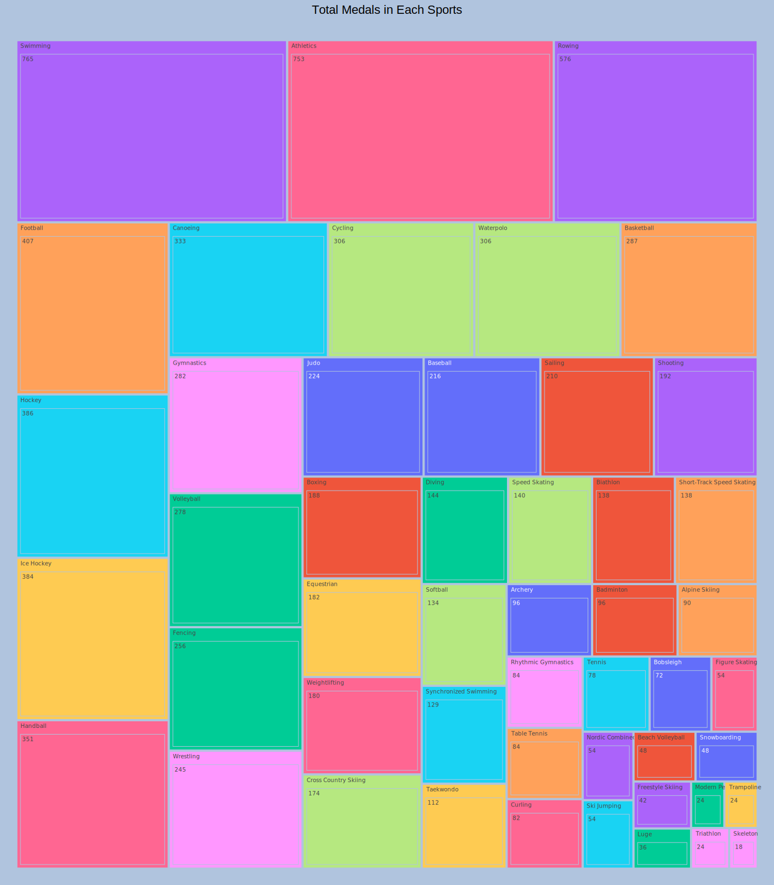
:::
:::

::: {.cell .markdown}
# Find the total number of medals won by each country in swimming and skelton ? {#find-the-total-number-of-medals-won-by-each-country-in-swimming-and-skelton-}
:::

::: {.cell .code execution_count="75" execution="{\"iopub.status.busy\":\"2022-05-31T17:32:21.842286Z\",\"shell.execute_reply.started\":\"2022-05-31T17:32:21.842760Z\",\"iopub.status.idle\":\"2022-05-31T17:32:21.887519Z\",\"iopub.execute_input\":\"2022-05-31T17:32:21.842802Z\",\"shell.execute_reply\":\"2022-05-31T17:32:21.886665Z\"}" trusted="true"}
``` {.python}
#groupby sports and country and than aggeregation
sp_count_TOt=sparkDF.groupby('sports','country').agg(sum("total_medal").alias("Total")).sort(desc("Total"))
```
:::

::: {.cell .code execution_count="76" execution="{\"iopub.status.busy\":\"2022-05-31T17:32:21.888681Z\",\"shell.execute_reply.started\":\"2022-05-31T17:32:21.888919Z\",\"iopub.status.idle\":\"2022-05-31T17:32:22.480416Z\",\"iopub.execute_input\":\"2022-05-31T17:32:21.888957Z\",\"shell.execute_reply\":\"2022-05-31T17:32:22.479461Z\"}" trusted="true"}
``` {.python}
#filter datafram based upon swimming and skelton
sp_count_TOt.filter(sp_count_TOt['sports']=='Swimming').show()
sp_count_TOt.filter(sp_count_TOt['sports']=='Skeleton').show()
```

::: {.output .stream .stdout}
    +--------+-------------+-----+
    |  sports|      country|Total|
    +--------+-------------+-----+
    |Swimming|United States|  267|
    |Swimming|    Australia|  163|
    |Swimming|  Netherlands|   46|
    |Swimming|        Japan|   43|
    |Swimming|       France|   39|
    |Swimming|        China|   35|
    |Swimming|      Germany|   32|
    |Swimming|       Russia|   20|
    |Swimming|        Italy|   16|
    |Swimming| South Africa|   11|
    |Swimming|Great Britain|   11|
    |Swimming|      Hungary|    9|
    |Swimming|       Sweden|    9|
    |Swimming|       Brazil|    8|
    |Swimming|     Zimbabwe|    7|
    |Swimming|      Ukraine|    7|
    |Swimming|      Romania|    6|
    |Swimming|       Canada|    5|
    |Swimming|  South Korea|    4|
    |Swimming|        Spain|    3|
    +--------+-------------+-----+
    only showing top 20 rows

    +--------+-------------+-----+
    |  sports|      country|Total|
    +--------+-------------+-----+
    |Skeleton|       Canada|    4|
    |Skeleton|United States|    3|
    |Skeleton|  Switzerland|    3|
    |Skeleton|Great Britain|    3|
    |Skeleton|      Germany|    2|
    |Skeleton|      Austria|    1|
    |Skeleton|       Latvia|    1|
    |Skeleton|       Russia|    1|
    +--------+-------------+-----+
:::
:::

::: {.cell .markdown}
# Find the number of medals that the US won yearly. {#find-the-number-of-medals-that-the-us-won-yearly}
:::

::: {.cell .code execution_count="77" execution="{\"iopub.status.busy\":\"2022-05-31T17:32:22.481622Z\",\"shell.execute_reply.started\":\"2022-05-31T17:32:22.482056Z\",\"iopub.status.idle\":\"2022-05-31T17:32:22.932391Z\",\"iopub.execute_input\":\"2022-05-31T17:32:22.482127Z\",\"shell.execute_reply\":\"2022-05-31T17:32:22.931402Z\"}" trusted="true"}
``` {.python}
# filter by country than groupby by year and country , after this aggergation on total number of medals
sparkDF.filter(sparkDF['country']=='United States').groupby('year','country').agg(sum("total_medal").alias("Total")).sort(desc("year")).show()
```

::: {.output .stream .stdout}
    +----+-------------+-----+
    |year|      country|Total|
    +----+-------------+-----+
    |2012|United States|  254|
    |2010|United States|   97|
    |2008|United States|  317|
    |2006|United States|   52|
    |2004|United States|  265|
    |2002|United States|   84|
    |2000|United States|  243|
    +----+-------------+-----+
:::
:::

::: {.cell .markdown}
# Find the total number of medals won by each country. {#find-the-total-number-of-medals-won-by-each-country}
:::

::: {.cell .code execution_count="78" execution="{\"iopub.status.busy\":\"2022-05-31T17:32:22.933578Z\",\"shell.execute_reply.started\":\"2022-05-31T17:32:22.935315Z\",\"iopub.status.idle\":\"2022-05-31T17:32:23.246746Z\",\"iopub.execute_input\":\"2022-05-31T17:32:22.935377Z\",\"shell.execute_reply\":\"2022-05-31T17:32:23.245844Z\"}" trusted="true"}
``` {.python}
# group by operation on country and aggeregation on total medals
sparkDF.groupby('country').agg(sum("total_medal").alias("Total")).sort(desc("Total")).show()
```

::: {.output .stream .stdout}
    +-------------+-----+
    |      country|Total|
    +-------------+-----+
    |United States| 1312|
    |       Russia|  768|
    |      Germany|  629|
    |    Australia|  609|
    |        China|  530|
    |       Canada|  370|
    |        Italy|  331|
    |Great Britain|  322|
    |       France|  318|
    |  Netherlands|  318|
    |  South Korea|  308|
    |        Japan|  282|
    |       Brazil|  218|
    |        Spain|  205|
    |       Norway|  192|
    |         Cuba|  188|
    |       Sweden|  181|
    |      Hungary|  145|
    |      Ukraine|  143|
    |    Argentina|  139|
    +-------------+-----+
    only showing top 20 rows
:::
:::

::: {.cell .markdown}
# Who was the oldest athlete in the olympics? Which country was he/she from?
:::

::: {.cell .code execution_count="79" execution="{\"iopub.status.busy\":\"2022-05-31T17:32:23.247936Z\",\"shell.execute_reply.started\":\"2022-05-31T17:32:23.248194Z\",\"iopub.status.idle\":\"2022-05-31T17:32:23.733558Z\",\"iopub.execute_input\":\"2022-05-31T17:32:23.248232Z\",\"shell.execute_reply\":\"2022-05-31T17:32:23.732631Z\"}" trusted="true"}
``` {.python}
# group by country , player name and age , after it max age and sort it by age
OLd_ath=sparkDF.groupby('New_name','country','age').max('age').sort(desc("max(age)")).limit(1)
OLd_ath.select('New_name','country','age').show()
```

::: {.output .stream .stdout}
    +----------+-------+----+
    |  New_name|country| age|
    +----------+-------+----+
    |Ian Millar| Canada|61.0|
    +----------+-------+----+
:::
:::
